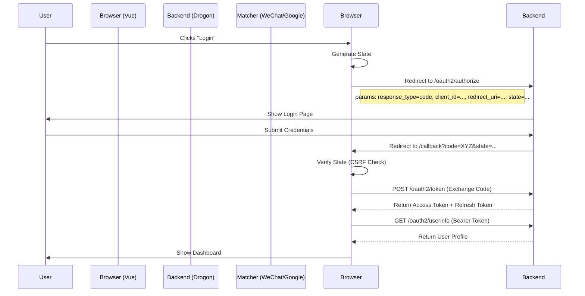

# Frontend Authorization Flow

This document describes how the Vue application interacts with the Drogon OAuth2 Provider to securely authenticate users.

## Overview

The application uses the **Authorization Code Flow** (with PKCE support planned for future) to obtain access tokens.

## Security Measures

### 1. State Parameter (CSRF Protection)

- **Generation**: A random UUID is generated before redirecting to the authorization server.
- **Storage**: Stored in `localStorage` as `auth_state_drogon`.
- **Validation**: On callback, the returned `state` query parameter is compared against the stored value.
- **Cleanup**: The stored state is removed immediately after validation.

### 2. Token Storage

- **Access Tokens**: Currently stored in `localStorage` for simplicity in this demo.
- **Recommendation**: For high security, consider using `HttpOnly` cookies to prevent XSS attacks extracting tokens.

### 3. Error Handling

- The `Callback.vue` component handles various error scenarios:
  - Missing code/state.
  - State mismatch (Potential attack).
  - Token exchange failure (e.g., Code expired).
  - User info fetch failure.

## External Providers (WeChat / Google)

For external providers, we implement a "Server-Side Exchange" pattern:

1. Frontend redirects to Provider (WeChat/Google) directly (or via a backend proxy url).
2. Provider redirects back to Frontend with `code`.
3. Frontend sends `code` to YOUR Backend Endpoint (`/api/wechat/login`).
4. **Backend** performs the exchange with Provider to get `openid`/`access_token`.
5. Backend creates a session or JWT for the internal system and returns it to Frontend.

This keeps external Client Secrets hidden on the server side.
