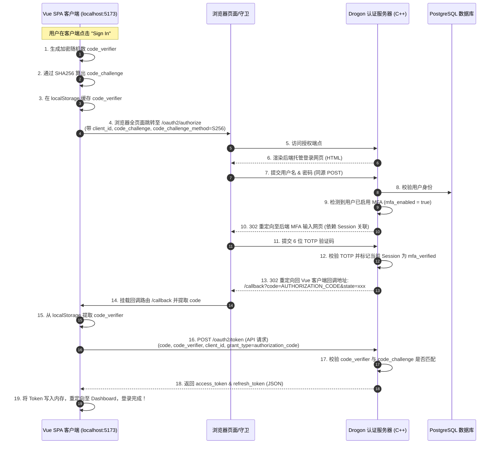

# 设计方案：基于 Authorization Code Flow with PKCE 的安全 MFA 登录架构

---

## 1. 背景与架构痛点 (Background)

在当前系统的真实端到端联调测试中，发现了核心用例 **`U-MFA-002` (MFA 验证成功后登录阻断)** 失败。

### 根因分析：
*   **API 层面逻辑不匹配**：后端 C++ 控制器 `MfaController::verifyLogin` 在用户输入正确的 6 位验证码并通过校验后，仅在 Drogon HTTP Session 中存入了已验证状态（`mfa_verified = true`），但由于接口原本非下发 Token 接口，因此响应的 JSON 中并未包含 `access_token` 或 `refresh_token`。
*   **前端会话鉴权断裂**：无状态的 Vue SPA 客户端不使用 Cookie Session。前端期望从 `/oauth2/mfa/verify` 的直接 API 响应中获取 access_token 以完成 Bearer Token 头部注入。这导致二步验证通过后，前端因拿不到 Token 抛出 `MFA verification failed` 错误而卡死在登录界面。
*   **凭证暴露风险**：当前纯 API 直连模式（由前端渲染表单并通过 Axios 发送密码与 OTP）不符合现代 OAuth2 安全标准，使用户明文密码和二步验证密钥暴露在不受信任的 SPA 前端内存与代码中，存在 XSS 脚本窃听的漏洞。

---

## 2. 架构设计目标 (Design Goals)

1.  **安全凭证零暴露**：前端 SPA 不接触用户的明文密码与 OTP 密钥，将敏感身份输入限制在后端认证服务器同源的安全托管网页内。
2.  **业界标准合规**：遵循 **RFC 8252 (OAuth 2.0 for Native and Cloud-Based Apps)** 标准，为 SPA 客户端引入 **PKCE (Proof Key for Code Exchange)** 保护。
3.  **前后端完美解耦**：前端无需自行实现 MFA 表单、二维码渲染及未来可能扩展的 WebAuthn/Passkey 指纹验证界面，降低前端复杂度，由后端同源网页统一托管验证逻辑。

---

## 3. 技术方案详述 (Detailed Implementation Plan)

引入方案一（标准 OAuth 2.0 授权码模式 + PKCE）将登录与 MFA 完全托管在后端网页。

### 3.1 核心时序图 (Sequence Diagram)



### 3.2 步骤详解

#### 1. 前端构造 PKCE 并跳转
当前端用户点击登录时，前端生成：
*   `code_verifier`：高强度随机字符串（如 $43-128$ 字符）。
*   `code_challenge`：`BASE64URL-ENCODE(SHA256(ASCII(code_verifier)))`。
前端将 `code_verifier` 存入 `localStorage`，然后重定向至：
`http://localhost:8080/oauth2/authorize?response_type=code&client_id=vue-client&redirect_uri=http://localhost:5173/callback&code_challenge=CHALLENGE&code_challenge_method=S256`

#### 2. 后端登录与 MFA 页面渲染
Drogon 服务器接收到请求后，渲染登录 HTML。如果密码校验成功，且数据库中 `mfa_enabled` 为 `true`，则服务器将用户重定向至内部 MFA OTP 输入页面，并在此域名下使用 Session 跟踪用户状态。

#### 3. 后端同源多因素认证 (MFA)
用户输入 6 位验证码提交到后端的 `/oauth2/mfa/verify`（基于 Cookie 共享会话）。后端校验通过后，在会话中标记该授权流程已完全验证，并将授权码 `code` 随 302 状态码返回给前端回调地址：
`302 Redirect to http://localhost:5173/callback?code=AUTHORIZATION_CODE`

#### 4. 前端使用 PKCE 换取令牌
Vue 端的 `/callback` 路由被挂载，它提取出 URL Query 中的 `code`，以及 `localStorage` 中的 `code_verifier`，通过 API POST 向后端的 `/oauth2/token` 发送请求：
```http
POST /oauth2/token HTTP/1.1
Host: localhost:8080
Content-Type: application/x-www-form-urlencoded

grant_type=authorization_code
&code=AUTHORIZATION_CODE
&redirect_uri=http://localhost:5173/callback
&client_id=vue-client
&code_verifier=VERIFIER
```
后端在 `TokenService` 中：
1.  根据 `code` 查出之前绑定的 `code_challenge`。
2.  计算传入的 `code_verifier` 的 SHA-256 哈希值，验证是否与 `code_challenge` 匹配。
3.  匹配通过，直接生成并下发包含 `access_token` 和 `refresh_token` 的标准 JSON 响应。

---

## 4. 接口与代码改动点 (Code Changes)

### 4.1 后端 C++ 改动
1.  **授权码绑定 PKCE 字段**：
    在 `oauth2_auth_codes` 表和 ORM Model 中确保存在 `code_challenge` 和 `code_challenge_method` 字段。
2.  **MfaController 调整**：
    MFA 页面提交逻辑调整为同源会话操作。验证码通过后，不再向客户端直接下发 JSON，而是执行 302 重定向返回客户端的回调 URL。
3.  **TokenService 调整**：
    在 `grant_type=authorization_code` 验证分支中，添加 PKCE 验证：
    ```cpp
    // 伪代码：验证 code_verifier
    std::string computedChallenge = base64UrlEncode(sha256(codeVerifier));
    if (computedChallenge != dbAuthCode.codeChallenge) {
        throw oauth2::error::invalid_grant("PKCE verification failed");
    }
    ```

### 4.2 前端 Vue 改动
1.  **新增 `/callback` 页面组件**：
    解析 `code` 和 `state` 路由参数，并触发 `/oauth2/token` 异步交换请求。
2.  **重构 authStore 的 login 方法**：
    删除前端表单直接向后台发送明文密码的 Axios 请求，修改为执行全页面重定向至 `/oauth2/authorize`，并自动构建 PKCE 加密验证参数。

---

## 5. 安全性考量 (Security & Compliance)

*   **抵御授权码拦截攻击 (Authorization Code Interception Attack)**：
    即使中间人或恶意浏览器插件截获了重定向返回的 `code`，因为他们没有前端 localStorage 独占缓存的 `code_verifier` 原文，也无法向 `/oauth2/token` 兑换出任何有效 Access Token。
*   **彻底根除凭证外泄**：
    前端不再实现任何密码、验证码输入框，密码、MFA 密钥不在前端 JavaScript 内存中驻留，从源头上免疫了因 XSS 跨站脚本注入带来的核心凭证失窃风险。

---

## 6. 方案评审补充 (Review Addendum)

> 以下内容基于对当前代码（`SessionController.cc` / `MfaController.cc` / `OAuth2StandardController.cc` / `TokenService.cc` / `OAuth2Frontend`）的实际核对补充，用于把本方案补齐到可实施状态。**本节仅做方案澄清，不在本轮实施**；`U-MFA-002` 的修复走 §7 的最小方案单独处理。

### 6.1 现状澄清：SPA 登录当前完全没有走 PKCE 授权码流程

代码核查确认：`OAuth2Frontend/src/pages/auth/LoginPage.vue` 通过 `authService.login()` 直接 AJAX `POST /oauth2/login`（带 `json=true`），从未经过 `/oauth2/authorize`。`SessionController::login` 密码校验通过后直接调用 `plugin->generateAuthorizationCode(...)`，不检查/不下发 `code_challenge`。也就是说：

- 当前 SPA 首方登录路径 **没有 PKCE**，也没有走 `login.csp` 同源页面——`login.csp` 只在**第三方 / 未登录会话通过 `/oauth2/authorize` 重定向**时才会被渲染（见 `OAuth2StandardController::authorize` 的 `else` 分支）。
- `SessionController::login` 本身不做 consent 检查（`checkUserConsentAndProceed` 只存在于 `OAuth2StandardController::authorize` 内，当 session 已有 `userId` 时才触发）。

因此本方案要做的不是"给现有授权码流程补 MFA"，而是"把 SPA 首方登录从纯 AJAX 改造成走已有的 `/oauth2/authorize → /login → /oauth2/login` 重定向流程，并让这条流程支持 PKCE + MFA 两步"。需要在设计里明确写出这一点，否则实施者会误以为只是小改动。

### 6.2 会话状态传递字段清单与跨步骤防护（安全关键，原方案缺失）

时序图步骤 9→13（密码验证通过 → MFA 页面 → 生成 code）之间，**必须**由后端 Session 承载以下字段，并且第二步（TOTP 验证）生成 code 时只能从 Session 读取，不能相信 MFA 提交表单里重新携带的同名字段：

| 字段 | 来源 | 用途 | 风险（若允许 MFA 步骤覆盖） |
|------|------|------|------|
| `client_id` | 第一步登录请求 | 生成 code 时绑定 | 无法伪造，但仍应锁定 |
| `redirect_uri` | 第一步登录请求 | 生成 code 时绑定，`consumeAuthCode` 会校验一致性 | 攻击者若能在 MFA 步骤注入新值，可让最终 302 跳到任意地址（open redirect） |
| `scope` | 第一步登录请求 | 生成 code 时绑定 | 越权 scope |
| `state` | 第一步登录请求 | 最终 302 带回客户端 | 破坏 CSRF 防护（RFC 6749 §10.12 依赖 state 不可被中途替换） |
| `code_challenge` / `code_challenge_method` | 第一步登录请求 | 生成 code 时绑定，供 `/oauth2/token` 校验 | PKCE 保护被绕过 |
| `nonce` | 第一步登录请求 | OIDC id_token | 重放风险 |
| `pending_user_internal_id` / `pending_user_public_sub` | 密码校验成功后 | MFA 步骤查用户、生成 code 的 subject | 会话劫持者可冒充其他已过第一步的用户完成 MFA |
| `mfa_verified` (bool) | TOTP 验证成功后 | 防止跳过 MFA 步骤直接触发生成 code 的接口 | — |

**要求**：MFA 提交请求（`/oauth2/mfa/verify`）**只接受** `code`（6 位 TOTP）本身作为请求体参数；`client_id/redirect_uri/scope/state/code_challenge/nonce` 全部从 `req->session()` 读取，忽略请求体中的同名字段（即使客户端传了也不使用）。这是本方案落地时必须写进代码审查清单的一条硬性要求。

此外，Session 需要一个**短 TTL**（建议 5 分钟）的独立超时用于"已过密码验证但未过 MFA"状态，防止 Session 被长期占用为半认证状态；`session_timeout`/`session_max_age` 现有全局配置不区分这个阶段，需要额外的时间戳字段（如 `pending_mfa_since`）在 MFA 验证时二次校验。

### 6.3 与现有功能的兼容性影响

需要在正式设计中明确以下问题的取舍，原方案未涉及：

1. **GitHub 社交登录按钮**：`LoginPage.vue` 目前在同一页面同时提供账密登录和 GitHub OAuth 按钮。若账密登录改为整页跳转到后端 `login.csp`，GitHub 按钮要么迁移到 `login.csp` 页面重新实现一份，要么保留在 SPA 且和后端页面形成两套视觉/交互风格。需要二选一并写清楚。
2. **Consent 流程**：`SessionController::login` 目前对 `vue-client`（首方、`PUBLIC` 类型）不做 consent 检查。整页跳转后是否要求每次登录都看到 `consent.csp`？如果不要求，需要说明 `SessionController::login` 保持"首方免 consent"这一行为不变；如果要求，需要评估用户体验冲击。
3. **`SecurityPage.vue` 的 MFA setup/disable**：这两个接口（`/api/me/mfa/setup`、`/api/me/mfa/setup/verify`、`/api/me/mfa/disable`）是登录后在 SPA 内以 Bearer Token 调用的 JSON API，本方案不涉及、也不应该迁移到后端页面（它们发生在已登录状态，不属于"登录时暴露密码/OTP"的风险面）。设计文档应明确写出"仅登录时的第一次密码输入 + TOTP 输入迁移，MFA 的设置/禁用维持现状"，避免实施时误扩大范围。
4. **忘记密码 / 注册入口**：`login.csp` 已有 `frontend_register_url` 变量指向 SPA 注册页；忘记密码目前只在 SPA `LoginPage.vue` 内有链接，迁移后 `login.csp` 需要补一个到 SPA `/forgot-password` 的链接。

### 6.4 受影响测试清单（需在实施 PR 中同步更新，而非事后修复）

| 测试文件 | 当前假设 | 需要的改动 |
|---|---|---|
| `OAuth2Frontend/src/stores/auth.ts` / `authService.ts` | `login()` 直接 AJAX 拿 `mfa_required`/`code`；`verifyMfa()` 直接拿 `access_token` | 改为整页跳转 + `/callback` 路由统一走 code 交换 |
| `OAuth2Frontend/tests/e2e/helpers/mock-api.ts` | mock `/oauth2/login` 返回 JSON code；mock `/oauth2/mfa/verify` 直接返回 token | mock 需改为 302 重定向语义，或改用真实后端集成测试覆盖（Playwright mock 路由拦截跳转的方式要重新设计） |
| `OAuth2Frontend/scratch/run_playwright_test_p0.cjs`（`U-MFA-001~004`） | 断言 MFA 表单直接在 SPA `/login` 内渲染 | 需要重写为断言整页跳转到后端 `login.csp` / MFA 页 |
| `OAuth2Server/test/integration/auth/LoginEnforcementTest.cc` | 仅验证 DB 字段读写，未覆盖 HTTP 层行为 | 不受影响，但应补充针对新流程的集成测试 |
| `docs/frontend/test-cases.md`、`docs/design/test-coverage-gap-analysis.md` | 用例描述基于当前 SPA 内表单 | 需要同步更新用例描述 |
| `OAuth2Server/openapi.yaml`、`tools/refactor-baseline/endpoints/openapi.signature.txt` | `/oauth2/mfa/verify` 当前登记为返回 JSON（200/400/401） | 若改为 302，需要更新 OpenAPI 文档和签名基线，否则 CI 的 baseline diff 检查会失败 |

### 6.5 安全表述澄清

原文档"彻底根除凭证外泄"、"密码/MFA 密钥不在前端 JavaScript 内存中驻留，从源头上免疫 XSS"等表述范围过大，需要澄清：

- 该方案只消除了**登录这一步**（密码 + TOTP 输入）在 SPA 内存/DOM 中出现的风险。
- **access_token 换发之后仍然常驻 SPA 内存**（`OAuth2Frontend/src/services/http.ts` 现状如此，本方案不改变这一点），XSS 攻击者若能执行任意 JS，依然可以读取内存中的 `access_token` 并冒充用户发起请求——这个风险面本方案不解决。
- 因此准确的表述应是："降低了密码与 TOTP 密钥的 XSS 暴露窗口（仅登录时刻），而非消除 Token 泄露风险"。评审材料中的绝对化表述应改写，避免给出错误的安全保证预期。

### 6.6 实施范围建议：拆分为两个独立事项

1. **本轮（已排期，见 §7）**：`U-MFA-002` 最小修复——只让 `MfaController::verifyLogin` 在 TOTP 验证通过后签发 auth code / token，不改变现有 API 契约、不改变前端登录 UI、不引入整页跳转。
2. **独立提案（本节，暂不实施）**：把 SPA 首方登录迁移为 Authorization Code + PKCE + 后端同源托管页面。需要先就 §6.2~6.5 列出的问题给出明确决策（会话字段清单、GitHub 登录/consent 处理方式、测试迁移计划），再单独排期评审和实施，不与 bug 修复混在同一个改动里。

---

## 7. 最小修复方案（U-MFA-002，本轮实施）

### 7.1 目标

`MfaController::verifyLogin` 在 TOTP（或备份码）验证通过后，签发标准 OAuth2 授权码并立即用其兑换 `access_token`/`refresh_token`，直接在响应体中返回，不改变现有 HTTP 契约（仍是 200 JSON 响应，不引入 302）。

### 7.2 改动点

- `MfaController::verifyLogin` 接收前端已经在传的 `client_id`、`redirect_uri`（`authService.ts` 的 `verifyMfa()` 已经带了这两个字段），可选 `scope`/`code_challenge`/`code_challenge_method`/`nonce`。
- TOTP 校验通过后，调用 `OAuth2Plugin::generateAuthorizationCode(...)` 生成 code，再调用 `OAuth2Plugin::exchangeCodeForToken(...)` 直接兑换为 token，合并进同一个响应，避免前端二次请求 `/oauth2/token`。
- `mfa_token` 字段维持现状（`SessionController::login` 里存的是 `internalId` 字符串，用于查 `users` 表定位用户），不引入 Session 依赖，保持这个端点无状态可测的特性。
- 返回体新增 `access_token`/`refresh_token`/`token_type`/`expires_in`，与 `/oauth2/token` 保持一致的字段命名，便于前端 `authService.verifyMfa()` 复用现有的 `resp.data.access_token` 判断逻辑（该逻辑已经存在，无需改前端）。

### 7.3 不做的事

- 不引入 Session 跨步骤字段传递（那是 §6 架构方案的范畴）。
- 不改 `SessionController::login` 的 `mfa_required` 响应契约。
- 不改前端 UI/路由。
- 不改 `/oauth2/authorize`、`login.csp`、consent 流程。
