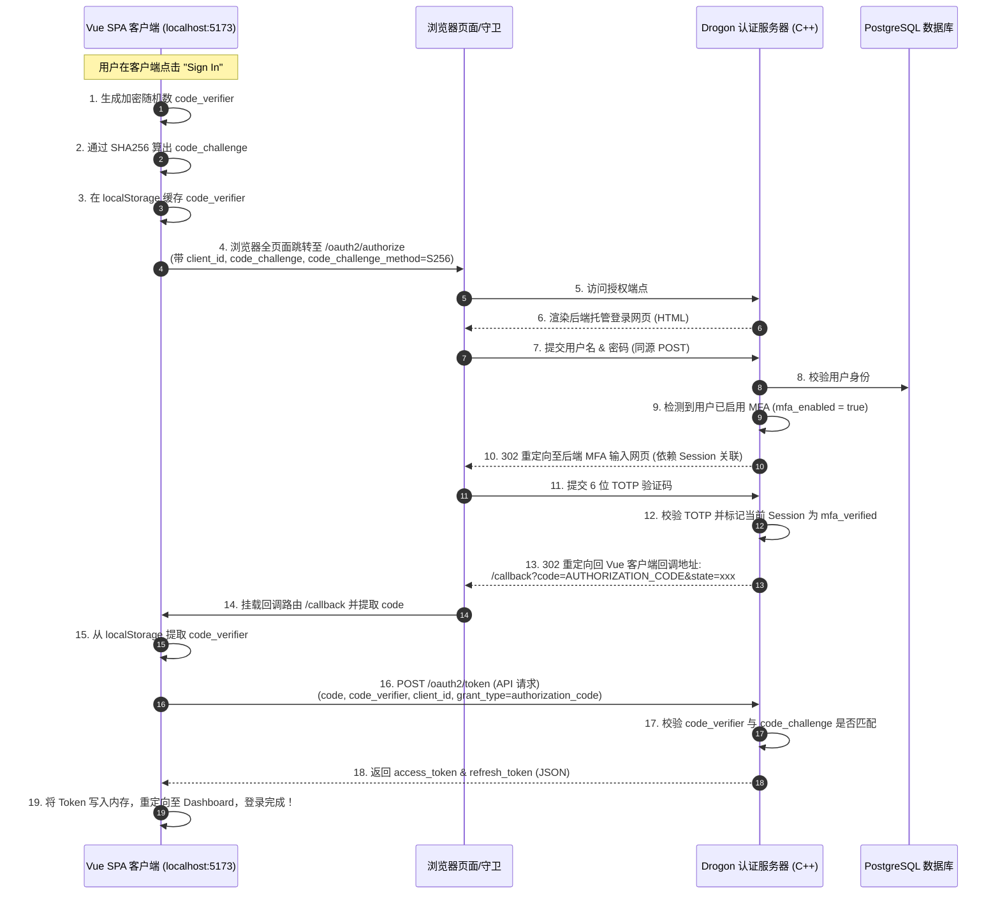

# 设计方案：基于 Authorization Code Flow with PKCE 的安全 MFA 登录架构

---

## 1. 背景与架构痛点 (Background)

在当前系统的真实端到端联调测试中，发现了核心用例 **`U-MFA-002` (MFA 验证成功后登录阻断)** 失败。

### 根因分析：
*   **API 层面逻辑不匹配**：后端 C++ 控制器 `MfaController::verifyLogin` 在用户输入正确的 6 位验证码并通过校验后，仅在 Drogon HTTP Session 中存入了已验证状态（`mfa_verified = true`），但由于接口原本非下发 Token 接口，因此响应的 JSON 中并未包含 `access_token` 或 `refresh_token`。
*   **前端会话鉴权断裂**：无状态的 Vue SPA 客户端不使用 Cookie Session。前端期望从 `/oauth2/mfa/verify` 的直接 API 响应中获取 access_token 以完成 Bearer Token 头部注入。这导致二步验证通过后，前端因拿不到 Token 抛出 `MFA verification failed` 错误而卡死在登录界面。
*   **凭证暴露风险**：当前纯 API 直连模式（由前端渲染表单并通过 Axios 发送密码与 OTP）不符合现代 OAuth2 安全标准，使用户明文密码和二步验证密钥暴露在不受信任的 SPA 前端内存与代码中，存在 XSS 脚本窃听的漏洞。

---

## 2. 架构设计目标 (Design Goals)

1.  **安全凭证零暴露**：前端 SPA 不接触用户的明文密码与 OTP 密钥，将敏感身份输入限制在后端认证服务器同源的安全托管网页内。
2.  **业界标准合规**：遵循 **RFC 8252 (OAuth 2.0 for Native and Cloud-Based Apps)** 标准，为 SPA 客户端引入 **PKCE (Proof Key for Code Exchange)** 保护。
3.  **前后端完美解耦**：前端无需自行实现 MFA 表单、二维码渲染及未来可能扩展的 WebAuthn/Passkey 指纹验证界面，降低前端复杂度，由后端同源网页统一托管验证逻辑。

---

## 3. 技术方案详述 (Detailed Implementation Plan)

引入方案一（标准 OAuth 2.0 授权码模式 + PKCE）将登录与 MFA 完全托管在后端网页。

### 3.1 核心时序图 (Sequence Diagram)



### 3.2 步骤详解

#### 1. 前端构造 PKCE 并跳转
当前端用户点击登录时，前端生成：
*   `code_verifier`：高强度随机字符串（如 $43-128$ 字符）。
*   `code_challenge`：`BASE64URL-ENCODE(SHA256(ASCII(code_verifier)))`。
前端将 `code_verifier` 存入 `localStorage`，然后重定向至：
`http://localhost:8080/oauth2/authorize?response_type=code&client_id=vue-client&redirect_uri=http://localhost:5173/callback&code_challenge=CHALLENGE&code_challenge_method=S256`

#### 2. 后端登录与 MFA 页面渲染
Drogon 服务器接收到请求后，渲染登录 HTML。如果密码校验成功，且数据库中 `mfa_enabled` 为 `true`，则服务器将用户重定向至内部 MFA OTP 输入页面，并在此域名下使用 Session 跟踪用户状态。

#### 3. 后端同源多因素认证 (MFA)
用户输入 6 位验证码提交到后端的 `/oauth2/mfa/verify`（基于 Cookie 共享会话）。后端校验通过后，在会话中标记该授权流程已完全验证，并将授权码 `code` 随 302 状态码返回给前端回调地址：
`302 Redirect to http://localhost:5173/callback?code=AUTHORIZATION_CODE`

#### 4. 前端使用 PKCE 换取令牌
Vue 端的 `/callback` 路由被挂载，它提取出 URL Query 中的 `code`，以及 `localStorage` 中的 `code_verifier`，通过 API POST 向后端的 `/oauth2/token` 发送请求：
```http
POST /oauth2/token HTTP/1.1
Host: localhost:8080
Content-Type: application/x-www-form-urlencoded

grant_type=authorization_code
&code=AUTHORIZATION_CODE
&redirect_uri=http://localhost:5173/callback
&client_id=vue-client
&code_verifier=VERIFIER
```
后端在 `TokenService` 中：
1.  根据 `code` 查出之前绑定的 `code_challenge`。
2.  计算传入的 `code_verifier` 的 SHA-256 哈希值，验证是否与 `code_challenge` 匹配。
3.  匹配通过，直接生成并下发包含 `access_token` 和 `refresh_token` 的标准 JSON 响应。

---

## 4. 接口与代码改动点 (Code Changes)

### 4.1 后端 C++ 改动
1.  **授权码绑定 PKCE 字段**：
    在 `oauth2_auth_codes` 表和 ORM Model 中确保存在 `code_challenge` 和 `code_challenge_method` 字段。
2.  **MfaController 调整**：
    MFA 页面提交逻辑调整为同源会话操作。验证码通过后，不再向客户端直接下发 JSON，而是执行 302 重定向返回客户端的回调 URL。
3.  **TokenService 调整**：
    在 `grant_type=authorization_code` 验证分支中，添加 PKCE 验证：
    ```cpp
    // 伪代码：验证 code_verifier
    std::string computedChallenge = base64UrlEncode(sha256(codeVerifier));
    if (computedChallenge != dbAuthCode.codeChallenge) {
        throw oauth2::error::invalid_grant("PKCE verification failed");
    }
    ```

### 4.2 前端 Vue 改动
1.  **新增 `/callback` 页面组件**：
    解析 `code` 和 `state` 路由参数，并触发 `/oauth2/token` 异步交换请求。
2.  **重构 authStore 的 login 方法**：
    删除前端表单直接向后台发送明文密码的 Axios 请求，修改为执行全页面重定向至 `/oauth2/authorize`，并自动构建 PKCE 加密验证参数。

---

## 5. 安全性考量 (Security & Compliance)

*   **抵御授权码拦截攻击 (Authorization Code Interception Attack)**：
    即使中间人或恶意浏览器插件截获了重定向返回的 `code`，因为他们没有前端 localStorage 独占缓存的 `code_verifier` 原文，也无法向 `/oauth2/token` 兑换出任何有效 Access Token。
*   **彻底根除凭证外泄**：
    前端不再实现任何密码、验证码输入框，密码、MFA 密钥不在前端 JavaScript 内存中驻留，从源头上免疫了因 XSS 跨站脚本注入带来的核心凭证失窃风险。
