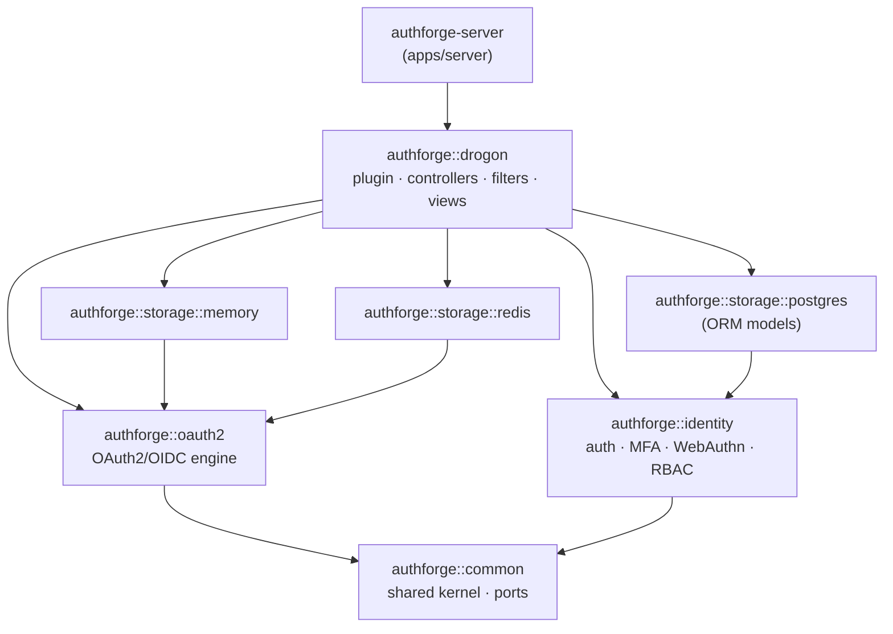

# AuthForge — Full-Stack OAuth2/OIDC Authorization Server

[中文文档](README.zh-CN.md)


[](https://github.com/voidvec/authforge/releases/latest)


[](benchmarks/competitors/results/COMPARISON.md)

Production-grade OAuth2.0/OIDC authorization server with full support for RFC 6749, RFC 7662, RFC 7009, and RFC 8414 — usable as a **ready-to-run product** (Docker/Helm) or as an **embeddable C++ SDK** (`find_package(authforge-*)`). Includes admin console, user-facing frontend, and a comprehensive test suite.

---

## Architecture

```
authforge/
├── apps/server/        # Authorization server backend (Drogon C++ framework)
├── libs/               # SDK library packages (authforge::common/oauth2/identity/storage-*/drogon)
├── frontends/admin/    # Admin console frontend (Vue 3 + TailwindCSS)
├── frontends/user/     # User-facing frontend (Vue 3 + Pinia + TailwindCSS)
├── examples/           # SDK consumer examples (find_package smoke hosts)
├── deploy/             # Docker Compose, Helm chart, nginx, observability
├── tests/              # Backend test suite (unit / integration / contract)
├── scripts/            # Build, test, and operations scripts
└── docs/               # Project documentation
```

### SDK Layering

The backend is split into 8 CMake packages with an enforced dependency direction (Domain layer never depends on Drogon; verified by `tools/arch-guard` in CI). Arrows read "depends on":



Optional feature areas are gated by Conan/CMake options (`with_identity` / `with_social` / `with_webauthn`) so SDK consumers can shrink the dependency surface.

### Tech Stack

| Layer | Technology |
|-------|------------|
| Backend Framework | Drogon (C++17) |
| Database | PostgreSQL 14+ |
| Cache | Redis 7+ |
| Admin Console | Vue 3 + Vite + Pinia + TailwindCSS |
| User Frontend | Vue 3 + Vite |
| Testing | CTest (C++) + Playwright (E2E) + PowerShell (API) |
| Monitoring | Prometheus + Audit Logging |
| Deployment | Docker Compose / Nginx |

---

## Features

### OAuth2/OIDC Core Protocols

| Feature | Standard | Endpoint |
|---------|----------|----------|
| Authorization Code + PKCE | RFC 6749 / RFC 7636 | `/oauth2/authorize`, `/oauth2/login`, `/oauth2/token` |
| Client Credentials | RFC 6749 | `/oauth2/token` (grant_type=client_credentials) |
| Token Refresh | RFC 6749 | `/oauth2/token` (grant_type=refresh_token) |
| Token Introspection | RFC 7662 | `/oauth2/introspect` |
| Token Revocation | RFC 7009 | `/oauth2/revoke` |
| OIDC Discovery | RFC 8414 | `/.well-known/openid-configuration` |
| JWKS | RFC 7517 | `/.well-known/jwks.json` |
| UserInfo | OIDC Core | `/oauth2/userinfo` |
| User Consent | OAuth2 | `/oauth2/consent` |
| Device Authorization | RFC 8628 | `/oauth2/device_authorization` |
| Dynamic Client Registration | RFC 7591 | `/oauth2/register` |

### User Authentication & Security

| Feature | Endpoint |
|---------|----------|
| User Registration | `POST /api/register` |
| Password Reset | `/api/password-reset/request`, `/api/password-reset/confirm` |
| Email Verification | `/api/verify-email`, `/api/verify-email/resend` |
| MFA (TOTP) | `/api/me/mfa/setup`, `/api/me/mfa/verify`, `/api/me/mfa/disable` |
| WebAuthn (FIDO2) | `/api/me/webauthn/register/*`, `/oauth2/webauthn/authenticate/*` |
| Google Login | `/api/google/login` |
| WeChat Login | `/api/wechat/login` |
| Account Lockout | Progressive lockout (5/10/15/20 failed attempts) |

### User Self-Service

| Feature | Endpoint |
|---------|----------|
| Profile | `GET /api/me` |
| Change Password | `PUT /api/me/password` |
| Authorized Apps | `GET/DELETE /api/me/authorized-apps` |
| Account Deletion | `DELETE /api/me` |

### Admin Console (frontends/admin)

| Module | Features |
|--------|----------|
| Dashboard | User count, app count, active tokens, failed login stats |
| App Management | Client CRUD, secret rotation, scope assignment, grant type config |
| User Management | User list/details, role assignment, disable/enable, lock status |
| Role Management | Role CRUD (protects built-in roles: admin/user) |
| Scope Management | Scope CRUD (protects built-in scopes: openid/profile/email/admin) |
| Token Management | Token listing, revocation by client/user, individual revocation |
| Organization Management | Multi-tenant organization CRUD |
| Audit Log | Paginated view, filter by event type/result |
| OIDC Keys | Signing key information |
| System Settings | Health monitoring |

### RBAC Permission System

- Role-based access control (admin / user / custom roles)
- URL pattern matching for permission checks (`/api/admin/.*` requires admin role)
- Triple-scope permission control (Client restriction + Role validation + Consent check)

### Observability

- Prometheus metrics export (`/metrics`)
- Structured audit logging (login, token issuance/revocation, password changes, etc.)
- Health check endpoints (`/health`, `/health/live`, `/health/ready`)

---

## Performance

Same-environment comparison against Keycloak 26.7.1, Ory Hydra v26.2.0, and Zitadel v4.17.1
(single idle host, serial same-session runs, each product on its officially recommended config,
identical PostgreSQL 17 backend, identical wrk staircase 2→128). AuthForge runs its documented
bench profile (pool 64/64, cache on, `auto_batch`, `reuse_port`, opt-in LTO build, TTL=30
retention-bounded sessions). **All five comparison scenarios lead** (2026-08-23 refresh,
[full report + methodology](benchmarks/competitors/results/COMPARISON.md)):

| Scenario | AuthForge | vs runner-up |
|---|---|---|
| discovery (`/.well-known/openid-configuration`) | 87,499 QPS | 2.1x Keycloak |
| client_credentials token issuance | 14,438 QPS | 2.6x Keycloak |
| token introspection | 22,458 QPS | 2.0x Ory Hydra |
| refresh_token rotation | 5,506 QPS | 1.9x Keycloak |
| userinfo | 49,302 QPS | 1.5x Keycloak |
| cold start (stack → first 200) | 1.26 s | 14.5x faster than Keycloak |

Honest qualifiers: measured on WSL2 8 vCPU / 16 GB (numbers are lower bounds, not bare-metal);
the "lightweight" story holds for the **embedded-SDK footprint (2.5 MB peak working set)**, not
the full container stack; per-segment P99 jitter is host-noise-dominated on this rig and is not
claimed as a differentiator (see the report's GC section).

### How to reproduce

```bash
# One command, four products, same-session serial (needs Docker + an idle host; ≈3 h end-to-end):
bash benchmarks/competitors/run-comparison.sh --fresh
# Regenerate the report from the committed result JSONs (no hand-typed numbers):
python3 benchmarks/reporting/gen-comparison.py
```

Methodology and fairness deviations (per-product config sources, what is and isn't aligned):
[competitor-benchmark-design.md](docs/productization-evolution/in-progress/competitor-benchmark-design.md).
AuthForge-side scenario details: [benchmarks/README.md](benchmarks/README.md).

---

## Quick Start

### Path A — Docker Compose (recommended for evaluation)

```bash
docker compose -f deploy/docker/docker-compose.yml up -d --build
```

- User Frontend: `http://localhost:8080`
- Admin Console: `http://localhost:8081`
- Backend API: `http://localhost:5555`

### Path B — Build from source

The canonical build is Conan 2 + CMake presets (identical to CI):

```bash
# 1. Resolve locked dependencies (writes toolchain into the preset's build dir)
conan install . --output-folder=build/linux-release --build=missing \
  -s build_type=Release -s compiler.cppstd=17

# 2. Configure + build
#    Presets: linux-release / windows-msvc / macos-arm64 (+ -debug / -asan / -tsan variants)
cmake --preset linux-release
cmake --build --preset linux-release

# 3. Run the backend test suite
ctest --test-dir build/linux-release --output-on-failure
```

`manage.ps1` (Windows) and `manage.sh` (Linux/macOS) wrap the same flow as convenience commands, e.g. `.\manage.ps1 build-backend`.

To run the full stack locally (backend requires PostgreSQL + Redis):

```powershell
# Backend
cd apps\server
..\..\build\windows-msvc\apps\server\Release\authforge-server.exe

# Admin console — http://localhost:5174/admin/
cd frontends\admin && npm install && npm run dev

# User frontend — http://localhost:5173
cd frontends\user && npm install && npm run dev
```

### Path C — Consume as an SDK

Embed AuthForge into your own C++ host via `find_package` (SDK tarball from [Releases](https://github.com/voidvec/authforge/releases), or `cmake --install` from source):

```cmake
# Full stack: one package pulls the whole closure (engine + Drogon plugin/controllers)
find_package(authforge-drogon CONFIG REQUIRED)
target_link_libraries(my-host PRIVATE authforge::drogon)

# Or engine-only (no Drogon dependency):
find_package(authforge-oauth2 CONFIG REQUIRED)
find_package(authforge-storage-memory CONFIG REQUIRED)
target_link_libraries(my-engine PRIVATE authforge::oauth2 authforge::storage::memory)
```

> v1.x promises **source-level SemVer** for the public headers (`include/authforge/**`), enforced by an api-diff gate in CI — no binary ABI guarantee. Resolve third-party dependencies with the repository's `conanfile.py` + `conan.lock`. Details: [SDK Integration Guide](docs/backend/sdk-integration-guide.md) · [SDK Runtime Contract](docs/backend/sdk-runtime-contract.md); reference consumers: [`examples/full-stack-host`](examples/full-stack-host), [`examples/third-party-host`](examples/third-party-host) (both CI-verified).

### Path D — Client SDKs (Python / Go)

Non-C++ services talk to AuthForge over its HTTP API with generated, typed clients plus a handwritten auth layer (token lifecycle is never templated):

```python
# Python (distribution authforge-oauth2, import authforge)
from authforge import m2m_client

client = m2m_client("http://localhost:5555", "backend-svc", "…", scopes=["tokens:read"])
```

```go
// Go (github.com/voidvec/authforge/clients/go)
client, _ := af.NewM2MClient(ctx, "http://localhost:5555", "backend-svc", "…", []string{"tokens:read"})
```

Both are generated from the single-source OpenAPI spec (`apps/server/openapi.yaml`) with a CI freshness gate. See [`clients/python`](clients/python) and [`clients/go`](clients/go). Package registry publishing (PyPI / Go module proxy) starts with the first tagged release shipping them.

### Default Credentials

| Username | Password | Role |
|----------|----------|------|
| admin | admin | admin |

---

## Deployment

| Target | Entry point | Notes |
|--------|-------------|-------|
| Docker Compose (dev) | `deploy/docker/docker-compose.yml` | Full stack + PostgreSQL + Redis, single command |
| Docker Compose (prod) | `deploy/docker/docker-compose.prod.yml` | TLS/nginx, env-file driven secrets |
| Kubernetes (Helm) | `deploy/helm/authforge` | Chart with values-driven config; schema migration runs as a Helm hook Job |

```bash
helm install authforge deploy/helm/authforge -f my-values.yaml
```

Full walkthroughs: [Production Deployment Guide](docs/ops/deployment.md) · [Windows / Docker Desktop](docs/ops/deployment-windows-docker-desktop.md) · [Security Checklist](docs/ops/security-checklist.md)

---

## Releases & Supply Chain Security

Releases are cut from SemVer tags (`vX.Y.Z`) by [`release.yml`](.github/workflows/release.yml):

- **SDK package** — `authforge-sdk-<ver>-linux-x86_64.tar.gz` (8 static libs + headers + CMake package configs) with `.sha256` checksum, attached to the GitHub Release.
- **Container images** — multi-arch (amd64 + arm64) on GHCR: `ghcr.io/voidvec/authforge-{backend,frontend,admin}:<ver>`.
- **Signatures** — image manifests are signed by digest with cosign (keyless, GitHub OIDC).
- **SBOMs** — SPDX JSON for each image and the source tree (syft), attached to the Release.

Verify before deploying:

```bash
# Image signature
cosign verify ghcr.io/voidvec/authforge-backend:<version> \
  --certificate-identity-regexp 'github.com/voidvec/.+/.github/workflows/release.yml' \
  --certificate-oidc-issuer https://token.actions.githubusercontent.com

# SDK tarball integrity
sha256sum -c authforge-sdk-<version>-linux-x86_64.tar.gz.sha256
```

---

## Testing

### Backend API Tests

```powershell
# Admin API full tests
.\scripts\backend\test-admin-endpoints.ps1

# OAuth2 core flow tests
.\scripts\backend\test-oauth2-endpoints.ps1
```

### Frontend E2E Tests

```powershell
cd frontends\admin
npx playwright test              # Full run
npx playwright test --ui         # UI mode for debugging
npx playwright test --headed     # Headed browser mode
```

### C++ Unit Tests

```powershell
cd build\windows-msvc
ctest --output-on-failure
```

### Test Coverage

| Test Type | Scope |
|-----------|-------|
| C++ Unit/Integration Tests (CTest) | SDK libraries, domain services, storage adapters |
| Admin API (PowerShell) | All Admin endpoints + Organization |
| OAuth2 Core (PowerShell) | Auth flows, token management, user services |
| Frontend E2E (Playwright) | Admin console and user frontend pages/interactions |

---

## API Documentation

- **OpenAPI Spec**: [openapi.yaml](apps/server/openapi.yaml)
- **Swagger UI**: `http://localhost:5555/docs/api` (requires Swagger UI static files)
- **E2E Testing Guide**: [E2E_TESTING_GUIDE.md](docs/admin/e2e-testing-guide.md)

---

## Documentation

**Evaluating** — [Architecture Overview](docs/backend/architecture-overview.md) · [Security Architecture](docs/backend/security-architecture.md) · [RBAC Guide](docs/backend/rbac-guide.md)

**Integrating (SDK)** — [SDK Integration Guide](docs/backend/sdk-integration-guide.md) · [SDK Runtime Contract](docs/backend/sdk-runtime-contract.md) · [API Reference](docs/backend/api-reference.md)

**Operating** — [Production Deployment](docs/ops/deployment.md) · [Configuration Guide](docs/backend/configuration-guide.md) · [Observability](docs/backend/observability.md) · [Account Lockout](docs/ops/account-lockout.md)

**Contributing** — [CONTRIBUTING.md](CONTRIBUTING.md) · [Testing Guide](docs/backend/testing-guide.md) · [CI/CD Pipeline](docs/backend/ci-cd-guide.md) · [Versioning & Release](docs/backend/versioning-and-release.md)

Full index: [docs/README.md](docs/README.md)

---

## System Requirements

| Component | Minimum Version |
|-----------|-----------------|
| C++ Compiler | C++17 (MSVC 2019+ / GCC 9+ / Clang 10+) |
| CMake | 3.21+ |
| PostgreSQL | 14+ |
| Redis | 7+ |
| Node.js | 18+ |
| Docker | 24+ (optional) |

---

## Contributing & Security

- Contributions welcome — see [CONTRIBUTING.md](CONTRIBUTING.md) for build, test, and commit conventions.
- To report a vulnerability, follow [SECURITY.md](SECURITY.md) — please do **not** open a public issue.

---

## License

MIT License — see [LICENSE](LICENSE)

---

**Project Status**: Production Ready | **Version**: v1.0.0
