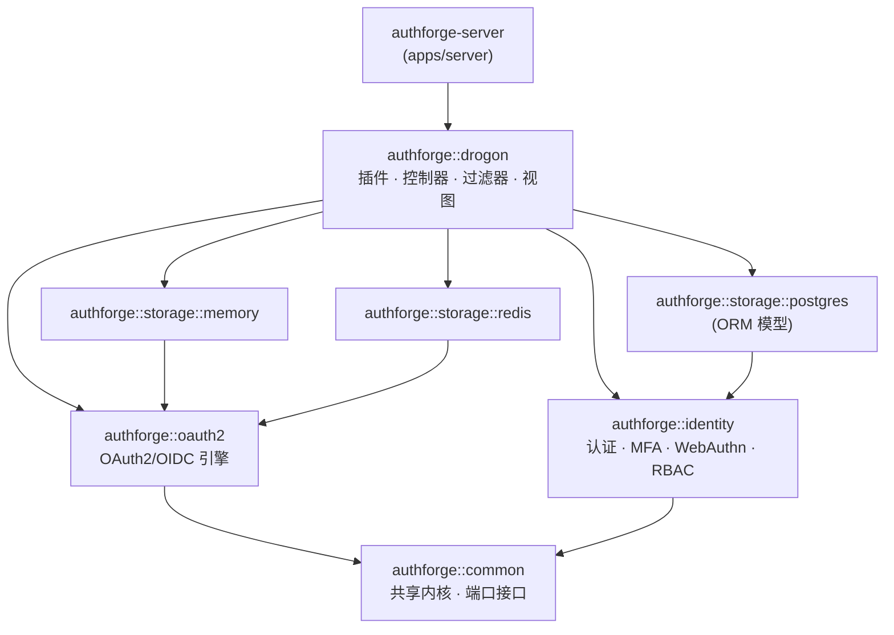

# AuthForge — 全栈 OAuth2/OIDC 授权服务器

[English](README.md)


生产级 OAuth2.0/OIDC 授权服务器，完整支持 RFC 6749、RFC 7662、RFC 7009、RFC 8414 标准——既可作为**开箱即用的产品**（Docker/Helm）部署，也可作为**可嵌入的 C++ SDK**（`find_package(authforge-*)`）集成。包含管理后台、前端客户端和完整的测试体系。

---

## 项目架构

```
authforge/
├── apps/server/        # 授权服务器后端（Drogon C++ 框架）
├── libs/               # SDK 库包（authforge::common/oauth2/identity/storage-*/drogon）
├── frontends/admin/    # 管理后台前端（Vue 3 + TailwindCSS）
├── frontends/user/     # 用户端前端（Vue 3 + Pinia + TailwindCSS）
├── examples/           # SDK 消费示例（find_package 冒烟宿主）
├── deploy/             # Docker Compose、Helm chart、nginx、可观测性
├── tests/              # 后端测试套件（单元 / 集成 / 契约）
├── scripts/            # 构建、测试、运维脚本
└── docs/               # 项目文档
```

### SDK 分层架构

后端拆分为 8 个 CMake 包，依赖方向受强制约束（Domain 层永不依赖 Drogon，由 CI 中的 `tools/arch-guard` 把关）。箭头语义为「依赖于」：



可选特性面由 Conan/CMake 选项门控（`with_identity` / `with_social` / `with_webauthn`），SDK 消费方可据此收缩依赖表面。

### 技术栈

| 层级 | 技术 |
|------|------|
| 后端框架 | Drogon (C++17) |
| 数据库 | PostgreSQL 14+ |
| 缓存 | Redis 7+ |
| 管理后台 | Vue 3 + Vite + Pinia + TailwindCSS |
| 用户前端 | Vue 3 + Vite |
| 测试 | CTest (C++) + Playwright (E2E) + PowerShell (API) |
| 监控 | Prometheus + 审计日志 |
| 部署 | Docker Compose / Nginx |

---

## 功能模块

### OAuth2/OIDC 核心协议

| 功能 | 标准 | 端点 |
|------|------|------|
| 授权码流程 + PKCE | RFC 6749 / RFC 7636 | `/oauth2/authorize`、`/oauth2/login`、`/oauth2/token` |
| 客户端凭证模式 | RFC 6749 | `/oauth2/token` (grant_type=client_credentials) |
| Token 刷新 | RFC 6749 | `/oauth2/token` (grant_type=refresh_token) |
| Token 内省 | RFC 7662 | `/oauth2/introspect` |
| Token 撤销 | RFC 7009 | `/oauth2/revoke` |
| OIDC Discovery | RFC 8414 | `/.well-known/openid-configuration` |
| JWKS | RFC 7517 | `/.well-known/jwks.json` |
| UserInfo | OIDC Core | `/oauth2/userinfo` |
| 用户同意 | OAuth2 | `/oauth2/consent` |
| 设备授权流 | RFC 8628 | `/oauth2/device_authorization` |
| 动态客户端注册 | RFC 7591 | `/oauth2/register` |

### 用户认证与安全

| 功能 | 端点 |
|------|------|
| 用户注册 | `POST /api/register` |
| 密码重置 | `/api/password-reset/request`、`/api/password-reset/confirm` |
| 邮箱验证 | `/api/verify-email`、`/api/verify-email/resend` |
| MFA (TOTP) | `/api/me/mfa/setup`、`/api/me/mfa/verify`、`/api/me/mfa/disable` |
| WebAuthn (FIDO2) | `/api/me/webauthn/register/*`、`/oauth2/webauthn/authenticate/*` |
| 外部登录 (Google) | `/api/google/login` |
| 外部登录 (微信) | `/api/wechat/login` |
| 账号锁定保护 | 渐进式锁定（5/10/15/20次失败递增） |

### 用户自助服务

| 功能 | 端点 |
|------|------|
| 个人资料 | `GET /api/me` |
| 修改密码 | `PUT /api/me/password` |
| 已授权应用管理 | `GET/DELETE /api/me/authorized-apps` |
| 注销账号 | `DELETE /api/me` |

### Admin 管理后台 (frontends/admin)

| 模块 | 功能 |
|------|------|
| 仪表盘 | 用户数、应用数、活跃Token数、失败登录统计 |
| 应用管理 | Client CRUD、Secret 重置、Scope 分配、Grant Type 配置 |
| 用户管理 | 用户列表/详情、角色分配、禁用/启用、锁定状态查看 |
| 角色管理 | 角色 CRUD（保护内置角色 admin/user） |
| Scope 管理 | Scope CRUD（保护内置 Scope openid/profile/email/admin） |
| Token 管理 | Token 列表、按客户端/用户撤销、单个撤销 |
| 组织管理 | 多租户组织 CRUD |
| 审计日志 | 分页查看、按事件类型/结果筛选 |
| OIDC 密钥 | 签名密钥信息查看 |
| 系统设置 | 健康状态监控 |

### RBAC 权限系统

- 基于角色的访问控制（admin / user / 自定义角色）
- URL 模式匹配的权限检查（`/api/admin/.*` → admin 角色）
- 三重 Scope 权限控制（Client 限制 + Role 校验 + Consent 检查）

### 可观测性

- Prometheus 指标导出 (`/metrics`)
- 结构化审计日志（登录、Token 签发/撤销、密码变更等）
- 健康检查端点 (`/health`、`/health/live`、`/health/ready`)

---

## 快速开始

### 路径 A — Docker Compose（推荐用于评估）

```bash
docker compose -f deploy/docker/docker-compose.yml up -d --build
```

- 用户前端：`http://localhost:8080`
- 管理后台：`http://localhost:8081`
- 后端 API：`http://localhost:5555`

### 路径 B — 源码构建

标准构建流程为 Conan 2 + CMake preset（与 CI 完全一致）：

```bash
# 1. 解析锁定的依赖（将 toolchain 写入 preset 对应的构建目录）
conan install . --output-folder=build/linux-release --build=missing \
  -s build_type=Release -s compiler.cppstd=17

# 2. 配置 + 构建
#    可用 preset：linux-release / windows-msvc / macos-arm64（另有 -debug / -asan / -tsan 变体）
cmake --preset linux-release
cmake --build --preset linux-release

# 3. 运行后端测试套件
ctest --test-dir build/linux-release --output-on-failure
```

`manage.ps1`（Windows）与 `manage.sh`（Linux/macOS）封装了同一流程，作为便捷命令使用，如 `.\manage.ps1 build-backend`。

本地运行全栈（后端需要 PostgreSQL + Redis）：

```powershell
# 后端
cd apps\server
..\..\build\windows-msvc\apps\server\Release\authforge-server.exe

# 管理后台 — http://localhost:5174/admin/
cd frontends\admin && npm install && npm run dev

# 用户前端 — http://localhost:5173
cd frontends\user && npm install && npm run dev
```

### 路径 C — 以 SDK 方式集成

通过 `find_package` 将 AuthForge 嵌入自己的 C++ 宿主（SDK 包取自 [Releases](https://github.com/lucaswang420/authforge/releases)，或从源码 `cmake --install`）：

```cmake
# 全栈：一个包拉取完整闭包（引擎 + Drogon 插件/控制器）
find_package(authforge-drogon CONFIG REQUIRED)
target_link_libraries(my-host PRIVATE authforge::drogon)

# 或仅取引擎面（无 Drogon 依赖）：
find_package(authforge-oauth2 CONFIG REQUIRED)
find_package(authforge-storage-memory CONFIG REQUIRED)
target_link_libraries(my-engine PRIVATE authforge::oauth2 authforge::storage::memory)
```

> v1.x 对公共头（`include/authforge/**`）承诺**源码级 SemVer**（CI 中 api-diff 门禁强制），不承诺二进制 ABI。第三方依赖请用仓库的 `conanfile.py` + `conan.lock` 解析。详见 [SDK 集成指南](docs/backend/sdk-integration-guide.md) · [SDK 运行时契约](docs/backend/sdk-runtime-contract.md)；参考消费方：[`examples/full-stack-host`](examples/full-stack-host)、[`examples/third-party-host`](examples/third-party-host)（均由 CI 持续验证）。

### 默认账号

| 用户名 | 密码 | 角色 |
|--------|------|------|
| admin | admin | admin |

---

## 部署

| 目标 | 入口 | 说明 |
|------|------|------|
| Docker Compose（开发） | `deploy/docker/docker-compose.yml` | 全栈 + PostgreSQL + Redis，一条命令拉起 |
| Docker Compose（生产） | `deploy/docker/docker-compose.prod.yml` | TLS/nginx，env 文件驱动的密钥配置 |
| Kubernetes（Helm） | `deploy/helm/authforge` | values 驱动配置；数据库 Schema 迁移以 Helm hook Job 执行 |

```bash
helm install authforge deploy/helm/authforge -f my-values.yaml
```

完整流程：[生产部署指南](docs/ops/deployment.md) · [Windows / Docker Desktop](docs/ops/deployment-windows-docker-desktop.md) · [安全清单](docs/ops/security-checklist.md)

---

## 发布与供应链安全

发布由 SemVer 标签（`vX.Y.Z`）触发 [`release.yml`](.github/workflows/release.yml) 产出：

- **SDK 包** — `authforge-sdk-<ver>-linux-x86_64.tar.gz`（8 个静态库 + 头文件 + CMake 包配置）附 `.sha256` 校验和，挂在 GitHub Release 附件。
- **容器镜像** — 多架构（amd64 + arm64）发布到 GHCR：`ghcr.io/lucaswang420/authforge-{backend,frontend,admin}:<ver>`。
- **签名** — 镜像 manifest 按 digest 用 cosign 签名（keyless，GitHub OIDC）。
- **SBOM** — 每个镜像及源码树的 SPDX JSON（syft 生成），附在 Release 中。

部署前验证：

```bash
# 镜像签名
cosign verify ghcr.io/lucaswang420/authforge-backend:<version> \
  --certificate-identity-regexp 'github.com/lucaswang420/.+/.github/workflows/release.yml' \
  --certificate-oidc-issuer https://token.actions.githubusercontent.com

# SDK 包完整性
sha256sum -c authforge-sdk-<version>-linux-x86_64.tar.gz.sha256
```

---

## 测试

### 后端 API 测试

```powershell
# Admin API 全量测试
.\scripts\backend\test-admin-endpoints.ps1

# OAuth2 核心流程测试
.\scripts\backend\test-oauth2-endpoints.ps1
```

### 前端 E2E 测试

```powershell
cd frontends\admin
npx playwright test              # 全量运行
npx playwright test --ui         # UI 模式调试
npx playwright test --headed     # 有头浏览器模式
```

### C++ 单元测试

```powershell
cd build\windows-msvc
ctest --output-on-failure
```

### 测试覆盖统计

| 测试类型 | 覆盖范围 |
|----------|----------|
| C++ 单元/集成测试 (CTest) | SDK 库、领域服务、存储适配器 |
| Admin API (PowerShell) | 全部 Admin 端点 + Organization |
| OAuth2 Core (PowerShell) | 认证流程、Token 管理、用户服务 |
| 前端 E2E (Playwright) | 管理后台与用户前端的页面和交互 |

---

## API 文档

- **OpenAPI 规范**：[openapi.yaml](apps/server/openapi.yaml)
- **Swagger UI**：`http://localhost:5555/docs/api`（需部署 Swagger UI 静态文件）
- **E2E 测试指南**：[E2E_TESTING_GUIDE.md](docs/admin/e2e-testing-guide.md)

---

## 项目文档

**评估选型** — [架构总览](docs/backend/architecture-overview.md) · [安全架构](docs/backend/security-architecture.md) · [RBAC 权限](docs/backend/rbac-guide.md)

**SDK 集成** — [SDK 集成指南](docs/backend/sdk-integration-guide.md) · [SDK 运行时契约](docs/backend/sdk-runtime-contract.md) · [API 参考](docs/backend/api-reference.md)

**运维部署** — [生产部署指南](docs/ops/deployment.md) · [配置指南](docs/backend/configuration-guide.md) · [可观测性](docs/backend/observability.md) · [账号锁定机制](docs/ops/account-lockout.md)

**参与贡献** — [CONTRIBUTING.md](CONTRIBUTING.md) · [测试指南](docs/backend/testing-guide.md) · [CI/CD 流水线](docs/backend/ci-cd-guide.md)

完整索引：[docs/README.md](docs/README.md)

---

## 系统要求

| 组件 | 最低版本 |
|------|----------|
| C++ 编译器 | C++17 (MSVC 2019+ / GCC 9+ / Clang 10+) |
| CMake | 3.23+ |
| PostgreSQL | 14+ |
| Redis | 7+ |
| Node.js | 18+ |
| Docker | 24+（可选） |

---

## 贡献与安全

- 欢迎贡献 — 构建、测试、提交规范见 [CONTRIBUTING.md](CONTRIBUTING.md)。
- 报告安全漏洞请遵循 [SECURITY.md](SECURITY.md) — 请**勿**直接提交公开 issue。

---

## 许可证

MIT License — 详见 [LICENSE](LICENSE)

---

**项目状态**：生产就绪 | **版本**：v1.0.0
