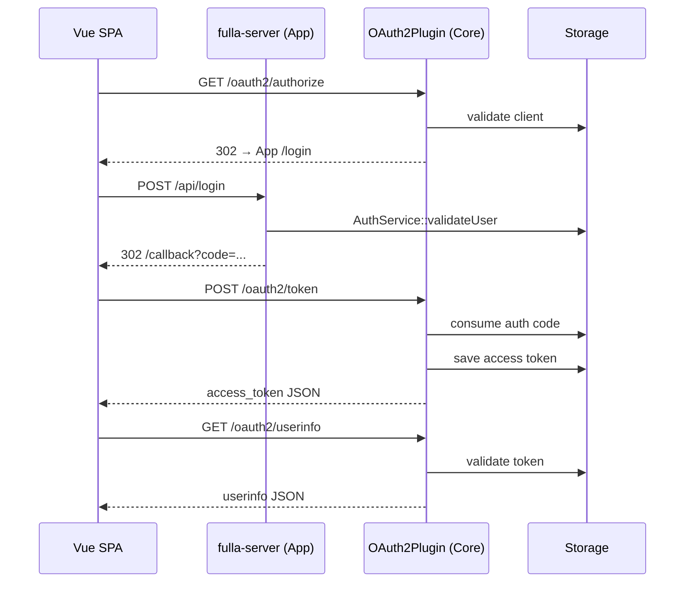

# 架构总览

本文从技术栈、模块布局、请求流转与部署形态四个视角，概括 fulla 的整体架构。

## 1. 技术栈

| 层 | 技术 | 用途 |
|---|---|---|
| Web 框架 | Drogon | 高性能异步 C++ HTTP 服务 |
| 主数据库 | PostgreSQL 17 | 用户、角色、客户端、授权码与令牌的持久化（2026-08-18 起为部署默认；服务端也可运行在 15 上——升级路径见 [PG 大版本升级](../operate/postgresql-major-upgrade.md)） |
| 缓存 / KV | Redis | Postgres 前置的可选 L2 缓存（client 与 access-token 读路径）；独立 Redis 存储已弃用（限流为进程内实现，不依赖 Redis） |
| 前端 | Vue 3 + Vite | OAuth2 授权码流程的 SPA 客户端 |
| 部署 | Docker Compose | 本地与类生产全栈部署 |
| 可观测 | Prometheus | 经 Drogon PromExporter 采集指标 |

## 2. 模块布局

为保证真正的可插拔，项目重构为「核心插件库 + 演示服务器」两层：

```text
HTTP 请求
  |
  |-- fulla-server（apps/server —— 演示服务器二进制）
  |   `-- AuthService：本地应用认证（libs/drogon/src/AuthService.cc）
  |
  `-- fulla::drogon（libs/drogon —— 独立 SDK 包，target fulla::drogon）
      |-- 插件核心
      |   `-- OAuth2Plugin：初始化与生命周期管理
      |
      |-- 协议控制器与过滤器（自动注册）
      |   |-- AuthorizationEndpointController / TokenEndpointController / DiscoveryController：
      |   |     处理 /oauth2/authorize、/oauth2/token、/.well-known/*、/userinfo
      |   `-- 过滤器：AuthorizationFilter、OAuth2AuthFilter
      |
      |-- 服务层（核心业务逻辑，libs/oauth2）
      |   |-- TokenService：PKCE、授权码/令牌的生成与交换
      |   |-- ClientService：客户端凭据与 redirect URI 校验
      |   `-- IdentityService：RBAC、subject 映射与用户同意
      |
      `-- 存储层（按仓储定义端口，按后端装配 Bundle）
          |-- I{Client,Grant,Token,Consent,UserInfo}Repository：存储端口（libs/oauth2）
          |-- MemoryRepositoryBundle：进程内测试存储（libs/storage-memory）
          |-- PostgresRepositoryBundle：持久化存储（libs/storage-postgres）
          `-- RedisRepositoryBundle：Redis 存储（libs/storage-redis）
```

## 3. 授权码流程



## 4. 存储策略

`OAuth2Plugin` 依据 `config.json` 中的 `storage_type` 选择后端。

| storage_type | 实现 | 典型用途 |
|---|---|---|
| memory | `MemoryRepositoryBundle` | 单元测试与本地快速演示 |
| redis | `RedisRepositoryBundle` | **已弃用**——启动时打 ERROR 日志，并以 `unsupported_grant_type` 拒绝 `refresh_token` 授权；不要使用。Redis 现在仅作为 Postgres 前置的可选缓存层（见[配置指南 §3](../operate/configuration-guide.md)） |
| postgres | `PostgresRepositoryBundle` | 生产持久化存储 |

> 每个 `*RepositoryBundle` 同时装配同一后端下的 client / grant / token / consent / userinfo 五个仓储实现（见各 `libs/storage-*/include` 下的头文件）。

## 5. 前后端集成

前端从登录页发起 OAuth2 授权码流程：将 CSRF `state` 存于 localStorage，
处理 `/callback`、用授权码换取令牌，随后调用 `/oauth2/userinfo`。

第三方社交登录时，前端接收外部授权码后提交给后端端点：

- `/api/google/login`
- `/api/wechat/login`

与 provider 的令牌交换在服务端完成，provider 密钥不暴露给浏览器。

## 6. 部署形态

Docker Compose 默认启动：

- `fulla-frontend`：端口 `8080`
- `fulla-admin`（管理后台）：端口 `8081`
- `fulla-backend`：端口 `5555`
- PostgreSQL：宿主端口 `5433`
- Redis：宿主端口 `6380`
- Prometheus：端口 `9090`

生产环境建议在反向代理终结 TLS，再将 API 请求代理到 Drogon 后端
（完整步骤见[生产部署](../operate/deployment.md)）。
