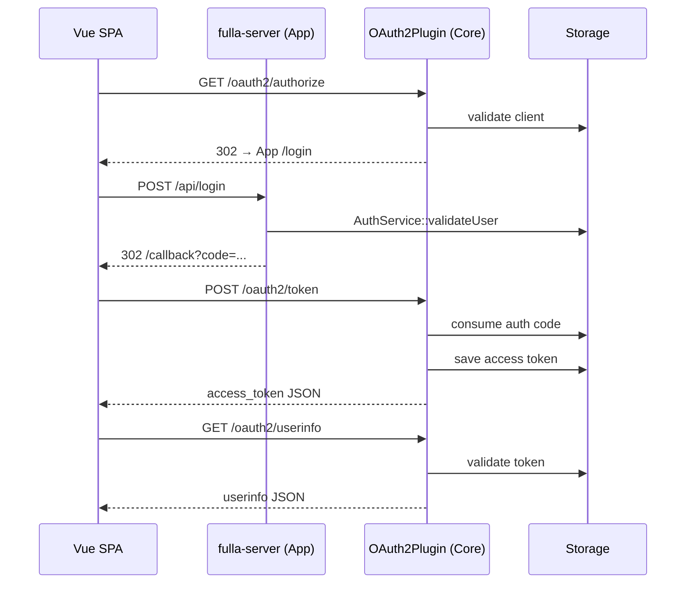

# Architecture Overview

This page summarizes the overall architecture of fulla from four perspectives: technology stack, module layout, request flow, and deployment topology.

## 1. Technology Stack

| Layer | Technology | Purpose |
|---|---|---|
| Web framework | Drogon | High-performance asynchronous C++ HTTP services |
| Primary database | PostgreSQL 17 | Persistence for users, roles, clients, authorization codes, and tokens (deployment default since 2026-08-18; the server also runs on 15 — see [PG Major-Version Upgrade](../operate/postgresql-major-upgrade.md) for the upgrade path) |
| Cache / KV | Redis | Optional L2 cache in front of Postgres (client and access-token read paths); the standalone Redis store is deprecated (rate limiting is implemented in-process and does not depend on Redis) |
| Frontend | Vue 3 + Vite | SPA client for the OAuth2 authorization-code flow |
| Deployment | Docker Compose | Local and production-like full-stack deployment |
| Observability | Prometheus | Metrics collected via the Drogon PromExporter |

## 2. Module Layout

To keep the system genuinely pluggable, the project is structured as two tiers: a core plugin library plus a demo server:

```text
HTTP 请求
  |
  |-- fulla-server（apps/server —— 演示服务器二进制）
  |   `-- AuthService：本地应用认证（libs/drogon/src/AuthService.cc）
  |
  `-- fulla::drogon（libs/drogon —— 独立 SDK 包，target fulla::drogon）
      |-- 插件核心
      |   `-- OAuth2Plugin：初始化与生命周期管理
      |
      |-- 协议控制器与过滤器（自动注册）
      |   |-- AuthorizationEndpointController / TokenEndpointController / DiscoveryController：
      |   |     处理 /oauth2/authorize、/oauth2/token、/.well-known/*、/userinfo
      |   `-- 过滤器：AuthorizationFilter、OAuth2AuthFilter
      |
      |-- 服务层（核心业务逻辑，libs/oauth2）
      |   |-- TokenService：PKCE、授权码/令牌的生成与交换
      |   |-- ClientService：客户端凭据与 redirect URI 校验
      |   `-- IdentityService：RBAC、subject 映射与用户同意
      |
      `-- 存储层（按仓储定义端口，按后端装配 Bundle）
          |-- I{Client,Grant,Token,Consent,UserInfo}Repository：存储端口（libs/oauth2）
          |-- MemoryRepositoryBundle：进程内测试存储（libs/storage-memory）
          |-- PostgresRepositoryBundle：持久化存储（libs/storage-postgres）
          `-- RedisRepositoryBundle：Redis 存储（libs/storage-redis）
```

## 3. Authorization-Code Flow



## 4. Storage Strategy

`OAuth2Plugin` selects the backend according to `storage_type` in `config.json`.

| storage_type | Implementation | Typical use |
|---|---|---|
| memory | `MemoryRepositoryBundle` | Unit tests and fast local demos |
| redis | `RedisRepositoryBundle` | **Deprecated** — logs an ERROR at startup and rejects the `refresh_token` grant with `unsupported_grant_type`; do not use. Redis now serves only as an optional cache layer in front of Postgres (see [Configuration Guide §3](../operate/configuration-guide.md)) |
| postgres | `PostgresRepositoryBundle` | Production persistent storage |

> Each `*RepositoryBundle` assembles all five repository implementations for its backend — client / grant / token / consent / userinfo (see the headers under each `libs/storage-*/include`).

## 5. Frontend–Backend Integration

The frontend starts the OAuth2 authorization-code flow from the login page: it stores
the CSRF `state` in localStorage, handles `/callback`, exchanges the authorization
code for tokens, and then calls `/oauth2/userinfo`.

For third-party social login, the frontend receives the external authorization code
and submits it to backend endpoints:

- `/api/google/login`
- `/api/wechat/login`

Token exchange with the provider happens on the server side; provider secrets are never exposed to the browser.

## 6. Deployment Topology

Docker Compose starts the following by default:

- `fulla-frontend`: port `8080`
- `fulla-admin` (admin console): port `8081`
- `fulla-backend`: port `5555`
- PostgreSQL: host port `5433`
- Redis: host port `6380`
- Prometheus: port `9090`

For production, terminate TLS at a reverse proxy and proxy API requests to the Drogon
backend (see [Production Deployment](../operate/deployment.md) for the full procedure).
