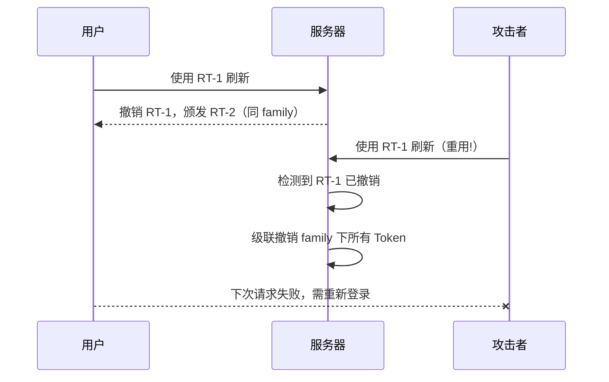

# OAuth2 Security Architecture

This document describes the system's security threat model and the corresponding defense mechanisms, covering token lifecycle management, secret storage, and anti-attack strategies.

## 1. Threat Model

| Threat | Description | Defense | Related docs |
|----------|------|----------|----------|
| **Replay Attack** | An attacker intercepts an auth code and attempts to redeem it before or after the legitimate client. | **Atomic Consume** + **One-Time Use Enforcement**. | [Data Consistency](data-persistence) |
| **Credential Leakage** | A database breach leaks client secrets. | **SHA256 Salted Hash**. The database stores only hashes, never plaintext. | [Data Persistence](data-persistence) |
| **Token Theft** | An access token is intercepted. | **Short-lived Token** (1 hour) + **Refresh Token Rotation**. | This document |
| **CSRF** | An attacker tricks a user into an unintended authorization. | Mandatory validation of the **state** parameter (recommended for clients to implement). | [API Reference](../domains/api-reference.md) |

## 2. Token Lifecycle Management

### 2.1 Access Token

- **Lifetime**: 1 hour.
- **Purpose**: Access to protected resources (e.g. `/userinfo`).
- **Validation**: stateless (JWT) or stateful (DB lookup). This project uses **stateful** validation, which supports immediate revocation.

### 2.2 Refresh Token

- **Lifetime**: 30 days.
- **Purpose**: Exchanged for a new token once the access token has expired.
- **Security mechanism: Rotation**
  - On every refresh, the server issues not only a new access token but also **a new refresh token**.
  - The old refresh token is invalidated immediately.
  - **Detection**: If an old refresh token is presented again, the system treats it as token theft and cascades revocation of every token under that `token_family` (implemented; see §7.2).

## 3. Secrets Management

### 3.1 Client Secrets

- **Storage**: `sha256(secret + salt)`
- **Transport**: Only over HTTPS, in the POST body.

### 3.2 Configuration Files

- Sensitive values (such as DB and Redis passwords) should be injected via **environment variables** rather than hardcoded in `config.json`.
- In production deployments, configuration file permissions should be strictly restricted.

## 4. Best-Practice Recommendations

- **HTTPS**: Production **must** enable HTTPS/TLS; without it, OAuth2 offers no security whatsoever.
- **PKCE**: Mobile/SPA clients should enable PKCE (Proof Key for Code Exchange) — this backend implements it and enforces it by default for PUBLIC clients, supporting both `plain` and `S256`.
- **IP allowlist**: For high-privilege clients, restrict the source IPs allowed to redeem tokens.

## 5. Token Storage Security

All tokens (access tokens, refresh tokens) are stored in the database **as SHA-256 hashes only** — never in plaintext.

- **Storage format**: `SHA-256(token_value)`
- **Validation flow**: client submits token → server computes the hash → compares against the stored hash
- **Benefit**: Even if the database leaks, an attacker cannot recover a valid token

## 6. Password Hashing Policy

### 6.1 Current Standard (OWASP 2023)

- **Algorithm**: PBKDF2-SHA256
- **Iterations**: 310,000 (per the OWASP 2023 recommendation)
- **Salt**: A unique random salt per user (16 bytes)
- **Output**: 32-byte key

### 6.2 Legacy Password Migration

The system supports gradual migration from the legacy single-iteration SHA-256 hashing to PBKDF2:

1. On login, the system detects the password hash format
2. If it is the legacy format (SHA-256), the hash is automatically upgraded to PBKDF2 after successful verification
3. The migration is transparent to users; no password reset is required

## 7. Refresh Token Rotation and Family Tracking

### 7.1 Family-Based Tracking

Every refresh-token chain shares a `token_family` identifier:

- A unique `token_family` ID is generated when the first RT is issued
- Subsequent rotated RTs inherit the same `token_family`
- The system can track the lifecycle of the entire token chain

### 7.2 Reuse Detection and Cascading Revocation

When a revoked refresh token is presented again:

1. **Detection**: The received RT is marked revoked in the database
2. **Verdict**: Treated as token theft (the attacker holds an old RT)
3. **Response**: Cascading revocation of **all** tokens under that `token_family`
4. **Outcome**: Both the legitimate user and the attacker must re-authenticate

### 7.3 Sequence Diagram



## 8. Subject Privacy

### 8.1 UUID public_sub

- **External identifier**: UUID v4 is used as the `public_sub` (public subject identifier)
- **Internal identifier**: The database auto-increment ID is used only for internal joins
- **Anti-enumeration**: UUIDs are unpredictable; attackers cannot enumerate users by incrementing IDs
- **OIDC compatibility**: The `sub` claim in `id_token` uses `public_sub`

### 8.2 Comparison

| Approach | Enumerable | Information leakage | OIDC compatible |
|------|--------|----------|-----------|
| Auto-increment ID | ✗ predictable | Leaks the user count | ✓ |
| UUID public_sub | ✓ unpredictable | No information leakage | ✓ |

## HTTP Security Response Headers

A global middleware attaches the following to every response: `X-Content-Type-Options: nosniff`, `X-Frame-Options: DENY`,
`Referrer-Policy: strict-origin-when-cross-origin`, and `Content-Security-Policy` (a restrictive policy for the API domain).

## Global Rate Limiting: Hodor (enabled in production configuration only)

Global-side rate limiting is handled by Drogon's official **Hodor** plugin (token bucket +
in-process CacheMap, at the IP/user/global levels), and it is **mounted only in `config.prod.json`**
(the development configuration does not include the plugin). Current production thresholds
(authoritative source is `config.prod.json`; this is a snapshot): `/oauth2/login` IP capacity 3 /
user capacity 2; `/oauth2/token` 5/min; all other endpoints 5000 global and 30 per IP. Rejected
responses are returned via the error envelope `VALIDATION_RATE_LIMITED` (429).

> Note on the relationship to F-018: this is **global-side** rate limiting (any request,
> anti-scanning); the in-process failure-count rate limiting in `configuration-guide` §8 is
> **authentication-side** brute-force protection (login/token failure counts). The two coexist
> and cover different surfaces.

## Security Operations Checklist

**Routine verification**: no secrets committed to the repository (`git grep` spot checks + the
Secret Hygiene CI gate); all `.env*` files ignored; frontend production builds contain no
embedded credentials.

**Key rotation**: JWKS currently uses a single static `kid` (F-029 is a follow-up operations
task; the rotation procedure is not automated); rotating DB/SMTP/social credentials = change
env vars + rolling restart.

**Incident response**: suspected leak → immediately rotate the affected credentials → if
historical commits are involved, rewrite them with `git filter-repo` (not the deprecated
filter-branch) and force-push → notify.

**pre-commit hook template** (optional):

```bash
#!/bin/sh
if git diff --cached | grep -qiE '(api[_-]?key|secret|password)\s*[:=]'; then
  echo "possible credential in commit"; exit 1
fi
```
