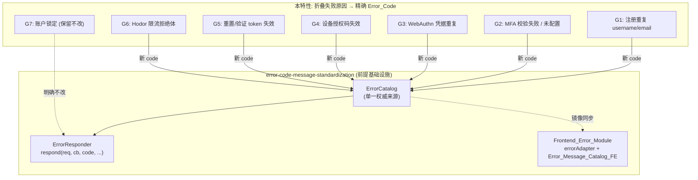

# Design Document

## Overview

本特性用于修复 `error-code-message-standardization` 特性发版后，在注册、登录及相邻认证流程（MFA、WebAuthn、设备授权、密码重置、邮箱验证、限流）中发现的错误信息缺口。触发原因是用户反馈「注册时用户名/邮箱重复」只显示一句笼统的"输入参数有误"，看不出具体是哪里冲突。经提交历史与代码审计复查，发现同样的「多种失败原因被折叠进同一个 code」模式在若干控制器中反复出现，因此判定为一类系统性缺口，需要统一补充设计。

本特性**依赖并扩展** `error-code-message-standardization` 特性已建成的基础设施——`ErrorCatalog`（单一权威错误码目录）、`ErrorResponder`（Application 统一错误响应入口）与 `Frontend_Error_Module`（前端 `errorAdapter` + `Error_Message_Catalog_FE`）。这些基础设施是本特性的前提条件；本设计不重复其完整设计，仅在必要处引用其组件、接口与既有正确性属性（详见下方 Correctness Properties 一节），聚焦于：

1. 新增 9 条 Error_Catalog 条目，覆盖注册重复、MFA、WebAuthn 凭据重复、密码重置/邮箱验证 token 失效、设备授权码失效、限流拒绝等此前被折叠的失败原因。
2. 逐个 Gap 给出后端控制器/服务层的改动点，使其把具体失败原因映射到新的、更精确的 Error_Code，而不是继续复用笼统的通用码。
3. 在 OAuth2Frontend 与 OAuth2Admin 两个前端应用的 `zh-CN.ts` 消息目录中同步补充对应词条，保持与既有「前端目录必须覆盖后端全部已登记 code」的约束一致。
4. 明确记录一项刻意保留、不作为缺口处理的设计决策（账户锁定的防枚举行为，G7），以及一项已知但超出本次范围的问题（前端/后端密码最小长度不一致 + 一条从未生效的校验规则）。

## Architecture

### Root Cause Analysis

`ErrorResponder::respond`（由 `error-code-message-standardization` 特性建成，见其 Components and Interfaces §3、`OAuth2Plugin/src/error/ErrorResponder.cc`）的核心行为是：给定一个 `code`，永远返回该 `code` 在 Error_Catalog 中登记的**默认 `message`**（该特性的 Requirement 5.6 明确要求：生产模式下 `message` 必须等于 Catalog 登记的默认 Client_Safe_Message，而非原始异常/业务文本）。

这个行为本身是正确且必要的（防止内部细节泄露）。但它有一个直接推论：**如果某个控制器把同一段代码路径中的多个不同失败原因（duplicate username / duplicate email / token 已用 / token 已过期 / 未找到 …）全部映射到同一个 `code`，客户端就必然看到同一句话**，因为 `ErrorResponder` 无从得知调用点想表达的是哪一种具体原因——它能看到的只有传入的 `code`。

这正是「注册重复邮箱/用户名显示笼统提示」问题的根因：`SessionController::registerUser` 的失败回调（`SessionController.cc` 约 846 行）无论 `AuthService::registerUser` 内部是因为用户名重复、邮箱重复、密码哈希失败还是角色分配失败，统一 `respondError(req, callback, "VALIDATION_INVALID_INPUT", ...)`。审计过程中确认同样的折叠模式还出现在 MFA、WebAuthn、设备授权、密码重置/邮箱验证等控制器中（见下方 Gap Inventory），因此判定为一类系统性缺口而非孤立 bug，遂以本特性统一处理。



## Components and Interfaces

本特性不引入任何新组件/类，全部复用 `error-code-message-standardization` 已建成的接口；唯一的接口契约变化是 G1 涉及的 `AuthService::registerUser` 回调签名调整。

### 复用的既有接口（继承自 error-code-message-standardization，本设计不重新定义）

- **`ErrorCatalog`**（`common::error::ErrorCatalog`，`OAuth2Plugin/src/error/ErrorCatalog.cc`）：单一权威错误码目录，提供 `find(code)` / `findByNumeric(numericCode)` / `allEntries()`。本特性仅向其 `rawEntries()` 静态数组追加 9 条 `CatalogEntry`（见下方 New Error Catalog Entries 一节与 Data Models 一节），不改动其接口签名。
- **`ErrorResponder`**（`common::error::ErrorResponder`，`OAuth2Plugin/src/error/ErrorResponder.cc`）：Application 端点统一错误响应入口，签名 `static void respond(const drogon::HttpRequestPtr &req, Callback &&cb, std::string code, std::string detailForLog = "", std::string clientDetails = "")`。各 Gap 的改动点均是把传入的 `code` 参数从旧的笼统码换成新码，不改动 `ErrorResponder` 本身。
- **`Error::fromCode`**（`common::error::Error::fromCode(std::string code, std::string requestId)`）：G6 中用于把 `VALIDATION_RATE_LIMITED` 构造为 `Error` 对象，再交给 `ErrorResponder::buildResponse` 生成 Envelope。
- **`Frontend_Error_Module`**（`errorAdapter` + `Error_Message_Catalog_FE`，`OAuth2Frontend/src/services/messages/zh-CN.ts` 与 `OAuth2Admin/src/services/messages/zh-CN.ts`）：前端错误规范化与本地化管线。本特性仅向两个 `zh-CN.ts` 目录追加词条，`errorAdapter.ts` 的 `normalizeError`/`getErrorMessage` 接口不变（见 Frontend Design 一节）。

### 接口变更：`AuthService::registerUser` 回调契约（G1）

这是本特性唯一的行为性接口改动。回调签名从携带自由文本错误消息，改为携带结构化错误码字符串，使调用方（`SessionController::registerUser`）能够将具体失败原因映射到精确的 `Error_Code`，而不必继续硬编码回退到 `VALIDATION_INVALID_INPUT`。

```cpp
// 变更前（error-code-message-standardization 发版时的状态）
using RegisterCallback = std::function<void(const std::string &error /* 自由文本，空串=成功 */)>;

// 变更后（本特性）
using RegisterCallback = std::function<void(const std::string &errorCode /* 结构化 Error_Code，空串=成功 */)>;
```

调用约定：`errorCode` 为空字符串表示注册成功；非空时必须是 `ErrorCatalog` 中已登记的 `code`（`VALIDATION_USERNAME_TAKEN`、`VALIDATION_EMAIL_TAKEN`，或未识别约束时的既有兜底码 `VALIDATION_INVALID_INPUT`）。调用方不再对回调参数做文本判断或拼接，直接将其转发给 `ErrorResponder::respond` 的 `code` 参数。详见 Backend Design G1 一节的完整实现示意。

## Data Models

本特性不新增数据结构，只是向既有结构填充新数据：

- **`CatalogEntry` 行数据**：9 条新增记录（`VALIDATION_USERNAME_TAKEN`、`VALIDATION_EMAIL_TAKEN`、`VALIDATION_CREDENTIAL_ALREADY_REGISTERED`、`VALIDATION_RESET_TOKEN_INVALID`、`VALIDATION_VERIFICATION_TOKEN_INVALID`、`VALIDATION_DEVICE_CODE_INVALID`、`VALIDATION_RATE_LIMITED`、`AUTH_MFA_CODE_INVALID`、`AUTH_MFA_NOT_CONFIGURED`），字段形状（`code`/`numericCode`/`category`/`httpStatus`/`defaultMessage`/`description`）继承自前提特性的 `CatalogEntry` 结构（见其 Data Models §Error_Catalog 初始条目），本特性不新增或修改任何字段。完整取值见下方「New Error Catalog Entries」一节的表格与 `RawEntry` 追加示意。
- **`NormalizedError`（前端）**：继承自前提特性的 `{ code: string; message: string; request_id: string; httpStatus: number }` 形状，无字段变化；本特性只是使其 `code` 字段可能取到新增的 9 个值。
- **`Error_Message_Catalog_FE`（前端）**：继承自前提特性的 `Record<locale, Record<errorCode, string>>` 形状；本特性在 `zh-CN` 语言下向 OAuth2Frontend 与 OAuth2Admin 两份目录追加与上述 9 个新 code 对应的键值对（见 Frontend Design 一节），不改变该结构本身。

## Gap Inventory

| ID | 位置 | 现状 | 问题 |
| --- | --- | --- | --- |
| G1 | `OAuth2Server/AuthService.cc::registerUser` + `OAuth2Server/controllers/SessionController.cc::registerUser` 回调（约 846 行） | 用户名重复、邮箱重复、密码哈希失败、角色分配失败均以 `std::string error` 传递文本，控制器一律映射为 `VALIDATION_INVALID_INPUT`（400） | 用户看不出具体冲突字段，且语义上「重复」应是 409 冲突而非 400 校验失败 |
| G2a | `OAuth2Server/controllers/MfaController.cc::verifySetup` TOTP 校验失败分支（约 164 行） | 复用 `AUTH_INVALID_CREDENTIALS`（"用户名或密码错误"） | MFA 设置页面没有用户名/密码输入框，这句提示不知所云 |
| G2b | `OAuth2Server/controllers/MfaController.cc::verifySetup` "尚未设置 MFA" 分支（约 150 行） | 复用通用 `VALIDATION_INVALID_INPUT` | 应给出「先完成设置」的状态引导，而非通用输入错误提示 |
| G3 | `OAuth2Server/controllers/WebAuthnController.cc::registerFinish`（约 215 行） | INSERT 未处理 `credential_id` 唯一约束冲突，落入通用 `DB_QUERY_ERROR`（"服务暂时不可用"） | 让用户误以为服务器宕机，实际是重复添加同一安全密钥 |
| G4 | `OAuth2Server/controllers/DeviceAuthController.cc::approveDevice`（约 259 行） | "未找到"、"已处理"、"已过期" 的 device user_code 统一落入 `VALIDATION_INVALID_INPUT` | 三种不同状态原因无法区分（此条不要求拆分为三个 code，仅要求给出更贴切的单一 code，见下方设计） |
| G5 | `PasswordResetController::confirm`、`EmailVerificationController::verify` | 过期/已用/无效 token 统一落入 `VALIDATION_INVALID_INPUT` | 防枚举意图（不区分「已过期」与「已使用」）应保留，但默认提示文案应更具行动指引 |
| G6 | `config.prod.json`（Hodor 插件配置）+ `OAuth2Server/main.cc` | Hodor 限流插件通过自身 `rejection_message` 配置直接返回 `text/plain` 的 "Too Many Requests" 429 响应体，完全不经过 `ErrorResponder`/Error Envelope | 违反前提特性 Requirement 7.3（Application 端点不得返回非 JSON 错误体）。Hodor 作为全局前置 advice，运行在任何控制器之外，是原迁移遗漏的覆盖面 |
| G7（明确不改动） | `AuthService.cc::validateUser` 账户锁定分支 | 锁定期内的登录尝试与「密码错误」一样返回 `AUTH_INVALID_CREDENTIALS` | 这是刻意设计，用于防止用户名枚举（参见 `docs/design/email-first-auth-design.md` §5.1）。本特性明确将其记录为「保留的设计决策」，而非待修复缺口 |

> 相关但超出本次范围的发现（另立验证策略工单，不在本次错误码补充范围内处理）：前端 `RegisterPage.vue` 客户端强制密码最少 6 位，而后端 `RuleSet::registerUser` 仅拒绝空密码或超过 200 字符（未真正强制最小长度）；同时 `RequestValidationFilter` 中为 `/api/register` 定义了 8 位长度 + `PASSWORD_PATTERN` 的校验规则，但该 filter 从未挂载到 `/api/register` 路由（`SessionController.h` 的 `ADD_METHOD_TO(SessionController::registerUser, "/api/register", Post)` 未附加该 filter），是一条已定义但未生效（dead）的规则。这是密码策略不一致的问题，与错误码文案无关，仅在此记录以便后续开工。

## New Error Catalog Entries

在 `OAuth2Plugin/src/error/ErrorCatalog.cc` 的 `rawEntries()` 数组末尾追加以下条目，延续现有数值段位（VALIDATION 3000-3099 当前最高 3005，AUTHENTICATION 4000-4099 当前最高 4003），不改动、不重排任何既有条目：

| Error_Code | numeric | category | HTTP（override） | 默认 Client_Safe_Message（zh-CN） |
| --- | --- | --- | --- | --- |
| `VALIDATION_USERNAME_TAKEN` | 3006 | VALIDATION | 409 | 该用户名已被注册 |
| `VALIDATION_EMAIL_TAKEN` | 3007 | VALIDATION | 409 | 该邮箱已被注册 |
| `VALIDATION_CREDENTIAL_ALREADY_REGISTERED` | 3008 | VALIDATION | 409 | 该安全密钥已注册，无需重复添加 |
| `VALIDATION_RESET_TOKEN_INVALID` | 3009 | VALIDATION | 400（类别默认，无 override） | 重置链接已失效，请重新申请 |
| `VALIDATION_VERIFICATION_TOKEN_INVALID` | 3010 | VALIDATION | 400（类别默认） | 验证链接已失效，请重新发送邮件 |
| `VALIDATION_DEVICE_CODE_INVALID` | 3011 | VALIDATION | 400（类别默认） | 设备码无效、已过期或已被处理 |
| `VALIDATION_RATE_LIMITED` | 3012 | VALIDATION | 429 | 请求过于频繁，请稍后重试 |
| `AUTH_MFA_CODE_INVALID` | 4004 | AUTHENTICATION | 401（类别默认） | 验证码不正确 |
| `AUTH_MFA_NOT_CONFIGURED` | 4005 | AUTHENTICATION | 401（类别默认） | 尚未设置双重验证，请先完成设置 |

对应的 `RawEntry` 追加示意（追加在 `rawEntries()` 现有 `std::array<RawEntry, 16>` 之后，数组大小需相应改为 25）：

```cpp
// VALIDATION (3000-3099) —— 注册/登录补充缺口 (G1, G3, G5, G6)
{"VALIDATION_USERNAME_TAKEN",
 3006,
 ErrorCategory::VALIDATION,
 "该用户名已被注册",
 "注册时用户名重复（VALIDATION 类，HTTP 409）",
 409},
{"VALIDATION_EMAIL_TAKEN",
 3007,
 ErrorCategory::VALIDATION,
 "该邮箱已被注册",
 "注册时邮箱重复（VALIDATION 类，HTTP 409）",
 409},
{"VALIDATION_CREDENTIAL_ALREADY_REGISTERED",
 3008,
 ErrorCategory::VALIDATION,
 "该安全密钥已注册，无需重复添加",
 "WebAuthn 凭据重复注册（VALIDATION 类，HTTP 409）",
 409},
{"VALIDATION_RESET_TOKEN_INVALID",
 3009,
 ErrorCategory::VALIDATION,
 "重置链接已失效，请重新申请",
 "密码重置 token 无效/过期/已用（VALIDATION 类）"},
{"VALIDATION_VERIFICATION_TOKEN_INVALID",
 3010,
 ErrorCategory::VALIDATION,
 "验证链接已失效，请重新发送邮件",
 "邮箱验证 token 无效/过期/已用（VALIDATION 类）"},
{"VALIDATION_DEVICE_CODE_INVALID",
 3011,
 ErrorCategory::VALIDATION,
 "设备码无效、已过期或已被处理",
 "设备授权 user_code 未找到/已处理/已过期（VALIDATION 类）"},
{"VALIDATION_RATE_LIMITED",
 3012,
 ErrorCategory::VALIDATION,
 "请求过于频繁，请稍后重试",
 "Hodor 限流拒绝（VALIDATION 类，HTTP 429）",
 429},

// AUTHENTICATION (4000-4099) —— MFA 补充缺口 (G2a, G2b)
{"AUTH_MFA_CODE_INVALID",
 4004,
 ErrorCategory::AUTHENTICATION,
 "验证码不正确",
 "MFA TOTP 校验失败（AUTHENTICATION 类）"},
{"AUTH_MFA_NOT_CONFIGURED",
 4005,
 ErrorCategory::AUTHENTICATION,
 "尚未设置双重验证，请先完成设置",
 "用户尚未完成 MFA 设置（AUTHENTICATION 类）"},
```

## Backend Design (per gap)

- **G1**：在 `AuthService::registerUser` 的 INSERT 之前先做存在性检查，或在现有 `mapper.insert` 的 `DrogonDbException` 回调中捕获后按约束/索引名匹配（复用前提特性 `ErrorHandler::handleDbException` 中已有的对 `e.base().what()` 做子串匹配的方式，如匹配 `users_username_key` 还是 `idx_users_email_unique`）以区分是用户名重复还是邮箱重复，进而映射为 `VALIDATION_USERNAME_TAKEN` 或 `VALIDATION_EMAIL_TAKEN`。当前回调签名 `std::function<void(const std::string &error)>` 只携带一句纯文本，需要改为携带（或让调用方能推断出）一个结构化的错误码，而不是像现在一样在 `SessionController::registerUser` 回调里无条件回退到 `VALIDATION_INVALID_INPUT`。示意：

  ```cpp
  // AuthService.h: 回调签名从 std::string error 改为携带错误码
  using RegisterCallback = std::function<void(const std::string &errorCode /* 空串=成功 */)>;

  // AuthService.cc::registerUser 的 insert 失败分支
  sharedCb {
      const std::string what = e.base().what();
      LOG_ERROR << "Register Failed: " << what;
      if (what.find("users_username_key") != std::string::npos)
          (*sharedCb)("VALIDATION_USERNAME_TAKEN");
      else if (what.find("idx_users_email_unique") != std::string::npos)
          (*sharedCb)("VALIDATION_EMAIL_TAKEN");
      else
          (*sharedCb)("VALIDATION_INVALID_INPUT");  // 未识别的约束，保底行为不变
  }
  ```

  `SessionController::registerUser` 的失败回调需要相应改为直接把收到的错误码传给 `respondError`，而不是硬编码 `VALIDATION_INVALID_INPUT`。

- **G2a/G2b**：将 `MfaController::verifySetup` 中两处 `respondError` 调用点分别改为 `AUTH_MFA_CODE_INVALID`（TOTP 校验失败分支）与 `AUTH_MFA_NOT_CONFIGURED`（"MFA not set up" 分支），仅改 `code` 参数，其余不变：

  ```cpp
  // MfaController.cc::verifySetup —— "尚未设置" 分支
  respondError(req, sharedCb, "AUTH_MFA_NOT_CONFIGURED",
               "verifySetup: MFA not set up. Call /api/me/mfa/setup first");
  // ...
  // TOTP 校验失败分支
  respondError(req, sharedCb, "AUTH_MFA_CODE_INVALID", "verifySetup: TOTP code is incorrect");
  ```

- **G3**：在 `WebAuthnController::registerFinish` 的 INSERT 的 `DrogonDbException` 回调中，通过 `e.base().what()` 子串匹配识别 `credential_id` 唯一约束冲突（与 G1 一致的模式匹配思路），命中时用 `VALIDATION_CREDENTIAL_ALREADY_REGISTERED` 取代通用 `DB_QUERY_ERROR`：

  ```cpp
  sharedCb, req {
      const std::string what = e.base().what();
      if (what.find("webauthn_credentials") != std::string::npos &&
          what.find("credential_id") != std::string::npos)
      {
          respondError(req, sharedCb, "VALIDATION_CREDENTIAL_ALREADY_REGISTERED",
                       std::string("registerFinish: duplicate credential_id: ") + what);
          return;
      }
      respondError(req, sharedCb, "DB_QUERY_ERROR",
                   std::string("registerFinish: failed to store credential: ") + what);
  }
  ```

- **G4**：将 `DeviceAuthController::approveDevice` 中 `result.affectedRows() == 0` 分支的 code 由 `VALIDATION_INVALID_INPUT` 改为 `VALIDATION_DEVICE_CODE_INVALID`，其余逻辑（含不区分「未找到/已处理/已过期」三种原因的行为）不变。

- **G5**：将 `PasswordResetController::confirm` 与 `EmailVerificationController::verify` 中 token 无效分支的 code 分别改为 `VALIDATION_RESET_TOKEN_INVALID` 与 `VALIDATION_VERIFICATION_TOKEN_INVALID`。保留现有的防枚举行为——即仍然不区分「已过期」与「已使用」，只是把默认提示文案换成更有行动指引的版本。

- **G6**（风险稍高，建议单独批次上线，因为改动的是全局插件接线而非单个控制器）：在 `main.cc` 加载 Hodor 插件之后，调用 `hodor->setRejectResponseFactory(...)`，通过前提特性提供的 `common::error::ErrorResponder::buildResponse` 用新的 `VALIDATION_RATE_LIMITED` 码构造 Error Envelope 响应（`RequestId` 从请求中解析），取代 Hodor 当前的纯文本拒绝体：

  ```cpp
  // main.cc，在 registerBeginningAdvice 汇报 Hodor 状态之后
  if (auto hodor = drogon::app().getPlugin<drogon::plugin::Hodor>())
  {
      hodor->setRejectResponseFactory([](const drogon::HttpRequestPtr &req) {
          common::error::Error error = common::error::Error::fromCode(
            "VALIDATION_RATE_LIMITED", common::error::RequestId::resolve(req)
          );
          return common::error::ErrorResponder::buildResponse(req, error);
      });
  }
  ```

  （实际 Hodor 插件回调签名以其头文件为准，此处为设计意图示意；接入前需核对 `drogon::plugin::Hodor` 是否提供等价的拒绝响应自定义钩子，若无则需要评估改为在自定义 filter 层实现限流拒绝的 Envelope 化。）

- **G7（明确不改动）**：`AuthService.cc::validateUser` 账户锁定分支继续返回与密码错误完全相同的 `AUTH_INVALID_CREDENTIALS`。这是刻意设计，用于防止用户名枚举（参见 `docs/design/email-first-auth-design.md` §5.1）。本特性不修改此行为，仅通过下方 Testing Strategy 中的回归测试固化该不变量，防止后续改动误将其"修复"为可区分的提示。

## Frontend Design

在 `OAuth2Frontend/src/services/messages/zh-CN.ts` 与 `OAuth2Admin/src/services/messages/zh-CN.ts` **两个文件同时**追加以下键值对（保持与前提特性 Property 14「跨应用映射确定性一致」要求锁步）：

```typescript
// --- 注册/登录相关补充缺口 (Post-Migration Gap Closure) ---
VALIDATION_USERNAME_TAKEN: '该用户名已被注册',
VALIDATION_EMAIL_TAKEN: '该邮箱已被注册',
VALIDATION_CREDENTIAL_ALREADY_REGISTERED: '该安全密钥已注册，无需重复添加',
VALIDATION_RESET_TOKEN_INVALID: '重置链接已失效，请重新申请',
VALIDATION_VERIFICATION_TOKEN_INVALID: '验证链接已失效，请重新发送邮件',
VALIDATION_DEVICE_CODE_INVALID: '设备码无效、已过期或已被处理',
VALIDATION_RATE_LIMITED: '请求过于频繁，请稍后重试',
AUTH_MFA_CODE_INVALID: '验证码不正确',
AUTH_MFA_NOT_CONFIGURED: '尚未设置双重验证，请先完成设置',
```

`errorAdapter.ts` 本身不需要任何改动——前提特性已建成的 `normalizeError`/`getErrorMessage` 管线已经能处理任意新 code，只要目录里有对应条目（这正是前提特性 AD-6「单一适配函数」设计决策的价值所在）。

## Error Handling

- **G1/G3 模式匹配未识别约束名**：`AuthService::registerUser`（G1）与 `WebAuthnController::registerFinish`（G3）都通过对 `DrogonDbException::base().what()` 做子串匹配来区分具体冲突约束（如 `users_username_key`、`idx_users_email_unique`、`credential_id`）。若数据库返回的约束名发生变化或出现未识别的约束名，匹配分支均落回既有的通用兜底码——G1 回退为 `VALIDATION_INVALID_INPUT`，G3 回退为 `DB_QUERY_ERROR`——保持与 `error-code-message-standardization` 发版时完全一致的安全默认行为，不会因未识别约束名而抛出异常或导致响应失败。
- **G6 Hodor 插件未加载**：`main.cc` 中对 `drogon::app().getPlugin<drogon::plugin::Hodor>()` 的调用点已有既有的空指针检查模式（`registerBeginningAdvice` 中用于汇报 Hodor 状态的同一检查）；本特性新增的 `setRejectResponseFactory(...)` 接线代码复用该检查，仅在插件确实已加载时才执行接线，插件未加载/未配置时跳过，不影响启动流程，不会导致进程崩溃。

## Correctness Properties

*A property is a characteristic or behavior that should hold true across all valid executions of a system—essentially, a formal statement about what the system should do. Properties serve as the bridge between human-readable specifications and machine-verifiable correctness guarantees.*

本特性新增的 9 条 Error_Catalog 条目与对应前端消息词条的**数据形状与覆盖完整性**，完全落在 `error-code-message-standardization` 特性已定义的 Property 5 与 Property 13 的覆盖范围内（见下方“复用的既有属性”），因此不需要为 Requirement 8、Requirement 9 新增属性测试。

但本特性同时引入了**新的行为性需求**——若干控制器/服务在特定失败原因下应当路由到哪个精确 Error_Code（Requirement 1、2、3、4、5、7）——这些行为在前提特性中不存在对应控制逻辑，因此不被 Property 5/13 覆盖，需要新增下列 7 条正确性属性。

### Property 1: 注册失败原因到 Error_Code 的精确路由

*对任意* 注册请求，若因用户名冲突而失败，SessionController 返回的 Error_Code 为 `VALIDATION_USERNAME_TAKEN`；若因邮箱冲突而失败，返回 `VALIDATION_EMAIL_TAKEN`；若因既非用户名也非邮箱冲突的原因失败，返回 `VALIDATION_INVALID_INPUT`；AuthService 通过 RegisterCallback 传递的字符串在任何情况下都是空字符串（成功）或 Error_Catalog 中已登记的 Error_Code（失败）；且 SessionController 收到非空字符串时将其原样转发给 Error_Responder 作为 Error_Code 参数（不做文本判断或硬编码回退），收到空字符串时判定成功且不调用 Error_Responder。

**Validates: Requirements 1.1, 1.2, 1.3, 1.4, 1.5, 1.6, 1.7**

### Property 2: MFA 校验失败原因到 Error_Code 的精确路由

*对任意* MFA 校验请求，若失败原因是尚未完成 MFA 设置，MfaController 返回的 Error_Code 为 `AUTH_MFA_NOT_CONFIGURED`；若失败原因是已完成设置但提交的 TOTP 验证码不正确，返回 `AUTH_MFA_CODE_INVALID`。

**Validates: Requirements 2.1, 2.2**

### Property 3: WebAuthn 凭据注册失败原因到 Error_Code 的精确路由

*对任意* WebAuthn 凭据注册写入失败，若失败原因是 credential_id 唯一约束冲突，WebAuthnController 返回的 Error_Code 为 `VALIDATION_CREDENTIAL_ALREADY_REGISTERED`，且数据库中已存在的凭据记录不因此次冲突写入尝试被修改或覆盖；若失败原因是其他数据库写入错误，返回既有兜底 Error_Code `DB_QUERY_ERROR`。

**Validates: Requirements 3.1, 3.2, 3.3**

### Property 4: 设备授权码失效原因的不可区分性

*对任意* 设备授权批准请求，无论 user_code 未找到、已被处理还是已过期，DeviceAuthController 返回的 Error_Code 均为 `VALIDATION_DEVICE_CODE_INVALID`，三种原因产生完全相同的响应码；且该 user_code 对应设备授权记录的现有状态不因此次被拒绝的批准请求发生任何变更。

**Validates: Requirements 4.1, 4.2, 4.3**

### Property 5: 密码重置 token 失效原因的不可区分性

*对任意* 密码重置确认请求，无论 token 无效、已过期还是已被使用，PasswordResetController 返回的 Error_Code 均为 `VALIDATION_RESET_TOKEN_INVALID`，各原因产生完全相同的响应码。

**Validates: Requirements 5.1, 5.3**

### Property 6: 邮箱验证 token 失效原因的不可区分性

*对任意* 邮箱验证请求，无论 token 无效、已过期还是已被使用，EmailVerificationController 返回的 Error_Code 均为 `VALIDATION_VERIFICATION_TOKEN_INVALID`，各原因产生完全相同的响应码。

**Validates: Requirements 5.2, 5.4**

### Property 7: 账户锁定与密码错误的防枚举不可区分性

*对任意* 用户账户与登录尝试，账户锁定期内的登录尝试所产生的 Error_Code、HTTP 状态码与响应体结构，与该账户密码错误时产生的 Error_Code、HTTP 状态码与响应体结构完全相同，无法通过响应区分两种情形。

**Validates: Requirements 7.1, 7.2**

### 复用的既有属性（继承自 error-code-message-standardization，覆盖 Requirement 8、9）

#### Property 5（前提特性编号，非本文档 Property 5）: Error_Catalog 完整性与唯一性

*对任意* Error_Catalog 条目，其 `code` 为非空字符串、`numeric_code` 为整数且落在其 Error_Category 对应的段位区间内、`category` 属于枚举集合、`httpStatus` 在 100..599 之间、默认 Client_Safe_Message 非空、说明长度合法；且在整个目录中 `code` 唯一、`numeric_code` 唯一。

本特性新增的 9 条条目（`VALIDATION_USERNAME_TAKEN` 3006、`VALIDATION_EMAIL_TAKEN` 3007、`VALIDATION_CREDENTIAL_ALREADY_REGISTERED` 3008、`VALIDATION_RESET_TOKEN_INVALID` 3009、`VALIDATION_VERIFICATION_TOKEN_INVALID` 3010、`VALIDATION_DEVICE_CODE_INVALID` 3011、`VALIDATION_RATE_LIMITED` 3012、`AUTH_MFA_CODE_INVALID` 4004、`AUTH_MFA_NOT_CONFIGURED` 4005）已按该属性的段位与唯一性规则设计（延续 VALIDATION 3000-3099、AUTHENTICATION 4000-4099 段位，不与既有条目冲突）。由于该属性的既有属性测试遍历 `ErrorCatalog::allEntries()` 的全量条目，追加条目后无需新增测试代码，测试会自动覆盖新条目；本特性不需要为此新增属性测试。

**Validates: Requirements 8.1, 8.2, 8.3, 8.4, 8.5, 8.6**（测试基础设施继承自 error-code-message-standardization，验证对象为本特性 Requirement 8）

#### Property 13（前提特性编号，非本文档 Property 13）: 前端信息目录覆盖与清洁性

*对任意* 后端 Error_Catalog 中登记的 Error_Code，Error_Message_Catalog_FE 都提供一条非空、不含未替换占位符标记的本地化条目；且所有展示给用户的信息均不包含 Request_ID 之外的后端 Internal_Detail。

本特性向 OAuth2Frontend 与 OAuth2Admin 的 `zh-CN.ts` 目录同时追加了与上述 9 个新 code 对应的键值对（见 Frontend Design 一节），词条内容均为面向用户的中文提示，不含 SQL、路径或堆栈片段。由于该属性的既有属性测试遍历后端 Catalog 全量 code 集合并断言前端目录覆盖，追加词条后测试会自动覆盖新 code；本特性不需要为此新增属性测试。

**Validates: Requirements 9.1, 9.2, 9.4**（测试基础设施继承自 error-code-message-standardization，验证对象为本特性 Requirement 9）

#### Property 14（前提特性编号）: 跨应用映射确定性一致

*对任意* Error_Code，OAuth2Frontend 与 OAuth2Admin 两个 Error_Message_Catalog_FE 中对应词条的文案完全一致。

本特性向两个前端应用同时追加相同的 9 条词条（见 Frontend Design 一节），内容逐字相同，满足该既有属性的跨应用一致性要求，不需要为此新增属性测试。

**Validates: Requirements 9.3**（测试基础设施继承自 error-code-message-standardization，验证对象为本特性 Requirement 9）

### Requirement 6（限流 Envelope 化）的测试策略说明

Requirement 6（Hodor 限流响应体 Envelope 化，含 6.1-6.3 的拒绝响应格式要求，6.4/6.5 的插件未加载时的启动与保证放宽行为，以及 6.6/6.7 对应的插件加载状态无法确定时的相同处理）描述的是全局插件接线行为：响应格式是否为 Envelope、启动时插件是否加载或加载状态是否可确定，均不随输入变化，属于集成/冒烟测试范畴（详见 Testing Strategy 一节），不产出新的正确性属性。

## Testing Strategy

除前提特性既有的 Property 5/13/14 测试自动覆盖新数据外，需要新增以下**属性测试**，覆盖本特性引入的控制器/服务路由行为（对应 Correctness Properties 一节 Property 1-7）：

- **Property 1**（注册失败路由）：生成随机的用户名/邮箱冲突组合（含"两者都冲突""都不冲突但违反其他未识别约束"等边界情形），断言 SessionController 返回码与失败原因一致，且 AuthService 回调字符串始终是空串或 Error_Catalog 中已登记的码
- **Property 2**（MFA 校验路由）：生成随机的"未配置 MFA"与"已配置但验证码错误"两类用户状态，断言返回码分别为 `AUTH_MFA_NOT_CONFIGURED` 与 `AUTH_MFA_CODE_INVALID`
- **Property 3**（WebAuthn 注册路由）：生成随机的凭据写入失败场景（credential_id 冲突 vs 其他 DB 错误），断言返回码路由正确，且冲突场景下数据库中已存在的凭据记录内容保持不变
- **Property 4**（设备码不可区分性）：生成随机的"未找到/已处理/已过期"三类 user_code 状态，断言三者返回码相同，且对应设备授权记录的现有状态不因被拒绝的批准请求发生变更
- **Property 5**（密码重置 token 不可区分性）：生成随机的"无效/已过期/已用" token 状态，断言三者返回码相同
- **Property 6**（邮箱验证 token 不可区分性）：同上，验证 EmailVerificationController
- **Property 7**（账户锁定防枚举）：生成随机账户与登录尝试组合（锁定期内 vs 密码错误），断言两者响应完全相同（**G7 回归测试**，防止后续改动误将其"修复"为可区分的提示）

以上属性测试均遵循前提特性已建成的测试框架（后端 `drogon_test.h` / `DROGON_TEST`，前端 `vitest` + `fast-check`），每个属性测试至少运行 100 次迭代，并标注 **Feature: auth-flow-error-code-gaps, Property \{number\}: \{property_text\}**。

此外，仍需要新增以下**示例/回归测试**（非属性测试），用于固化具体取值：

- 注册重复用户名 → 409 + `VALIDATION_USERNAME_TAKEN`
- 注册重复邮箱 → 409 + `VALIDATION_EMAIL_TAKEN`
- MFA 验证码错误 → `AUTH_MFA_CODE_INVALID`
- MFA 未配置 → `AUTH_MFA_NOT_CONFIGURED`
- WebAuthn 凭据重复注册 → `VALIDATION_CREDENTIAL_ALREADY_REGISTERED`
- 设备码复用/过期 → `VALIDATION_DEVICE_CODE_INVALID`
- 触发限流的请求 → JSON Error Envelope，`VALIDATION_RATE_LIMITED`，HTTP 429
- **G7 回归测试**：显式断言锁定期内登录尝试返回的 `AUTH_INVALID_CREDENTIALS` 与密码错误返回的完全一致（不可区分），以此固化「防枚举」不变量，防止后续改动误将其"修复"为可区分的提示

- 按前提特性 `ErrorCatalogRegressionTest.cc` 的现有风格与文件位置（`OAuth2Server/test/unit/error/`），为每个 Gap 新增上述示例/回归测试用例。
- 复用前提特性已建成的 **Drogon `drogon_test.h`（`DROGON_TEST` 宏）** 测试框架，无需引入新的后端测试依赖。
- 前端侧复用前提特性已建成的 **`vitest` + `fast-check`** 属性测试基础设施；本特性无需新增前端属性测试文件，只需确认现有 `messageCatalog.property.test.ts`（覆盖 Property 13）在新增词条后仍然通过，即可验证覆盖完整性。
- 由于 `test/CMakeLists.txt` 使用 `file(GLOB_RECURSE UNIT_TESTS ... unit/*.cc)`，新增测试文件会被自动纳入，无需改 CMake。
- G6（Hodor 限流 Envelope 化）建议作为独立批次验证与上线，因为改动的是全局插件接线而非单个控制器，风险面更广。
